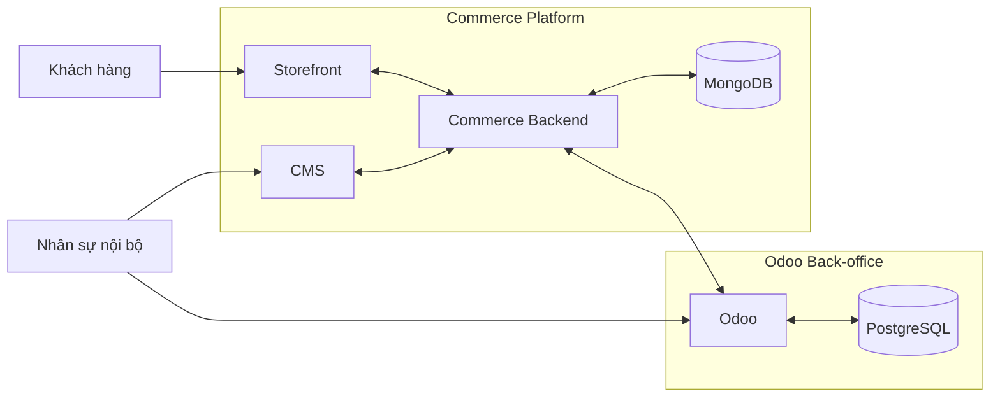

# BikeSport Commerce Platform

BikeSport là nền tảng thương mại điện tử dành cho hoạt động bán hàng xe đạp, phụ kiện và các sản phẩm liên quan. Hệ thống được tổ chức thành nhiều subsystem riêng để tách phần trải nghiệm mua sắm, quản trị nội dung, xử lý nghiệp vụ thương mại và vận hành back-office.

## Tổng quan hệ thống

### Storefront

Kênh mua sắm dành cho khách hàng, phục vụ các nhu cầu như duyệt danh mục, xem sản phẩm, giá và khuyến mãi, tìm cửa hàng, đặt hàng và theo dõi các thông tin liên quan đến quá trình mua hàng.

### CMS

Hệ thống quản trị phần dữ liệu và nội dung phục vụ website. CMS chịu trách nhiệm cho các nội dung có tính chất linh hoạt như thông tin hiển thị sản phẩm, thuộc tính sản phẩm, media, nội dung marketing, banner, bài viết và các nội dung thương mại điện tử khác.

### Commerce Backend

Lớp xử lý nghiệp vụ và trao đổi dữ liệu cho Commerce Platform. Backend kết nối Storefront/CMS với dữ liệu thương mại điện tử và với Odoo khi nghiệp vụ cần thông tin từ hệ thống back-office.

### Odoo Back-office

Odoo là hệ thống vận hành nội bộ, không chỉ dùng để quản lý tồn kho. Phạm vi hiện tại bao gồm các nhóm nghiệp vụ như:

- Stock workflow và quản lý tồn kho.
- Warehouse.
- Nhập, xuất và điều chuyển hàng.
- Reservation hàng hóa.
- Đơn hàng và các bước xử lý back-office liên quan.
- Pricing và promotion có liên quan đến vận hành.
- Bảo hành.
- Store/location.
- Phân quyền nhân sự theo phạm vi nghiệp vụ được phép truy cập.
- Đồng bộ dữ liệu phục vụ nhiều website/kênh bán hàng.

## Dữ liệu

Commerce Platform và Odoo sử dụng hai mô hình lưu trữ khác nhau theo đặc thù nghiệp vụ:

| Khu vực | Cơ sở dữ liệu | Vai trò chính |
| --- | --- | --- |
| Commerce / CMS | MongoDB | Dữ liệu thương mại điện tử có cấu trúc linh hoạt, đặc biệt là thuộc tính và nội dung sản phẩm |
| Odoo Back-office | PostgreSQL | Dữ liệu nghiệp vụ ERP/back-office và các module Odoo |

Việc sử dụng hai database không có nghĩa dữ liệu được quản lý độc lập hoàn toàn. Các nhóm dữ liệu dùng chung giữa Commerce và Odoo cần có ranh giới trách nhiệm và source of truth rõ ràng để tránh xung đột khi đồng bộ.

## Các domain chính

Hệ thống hiện được xem xét theo các domain nghiệp vụ chính:

- Product Catalog
- Pricing
- Promotion
- Inventory
- Warehouse
- Order
- Fulfillment
- Warranty
- Store / Location
- Customer
- Content
- Staff & Permission
- Multi-site Synchronization

Mỗi domain có thể đi qua nhiều subsystem. Ví dụ một đơn hàng có thể được tạo từ Storefront, xử lý qua Commerce Backend và tiếp tục các bước reservation, kho hoặc fulfillment trong Odoo. Vì vậy ranh giới nghiệp vụ được xác định theo trách nhiệm của từng hệ thống thay vì chỉ theo frontend, backend hoặc database.

## Tài liệu yêu cầu

BRD, FRD, SRS, integration specification, process flow, use case và traceability được phát triển trên các branch `docs/*` riêng. Các tài liệu đang trong quá trình phân tích không được cập nhật trực tiếp vào `master`.

Branch `master` giữ phần mô tả tổng quan của repository và các nội dung đã được quyết định đưa vào nhánh chính.

## Trạng thái

Project đang ở giai đoạn phân tích và đặc tả hệ thống. Một số quyết định như source of truth của Product, Pricing, Promotion, Order và quy tắc đồng bộ giữa Commerce với Odoo vẫn cần được xác nhận trước khi khóa thiết kế chi tiết.
