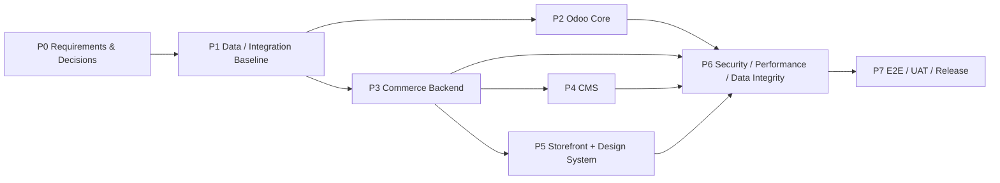

# BikeSport Roadmap & Project Status

**Ngày cập nhật:** 2026-08-15  
**Trạng thái:** Active Draft

Tài liệu này là view PM cấp cao. Chi tiết task nằm trong `06-engineering/project-task-board.md`.

## 1. Phase roadmap

## 2. Current phase status

| Phase | Objective | Status | Main blocker | Exit evidence |
| --- | --- | --- | --- | --- |
| P0 | Requirements + business/architecture decisions | IN_PROGRESS | DEC-001..010 | Approved decision log + updated BRD/FRD/ownership |
| P1 | Canonical schema + integration contracts | IN_PROGRESS/REVIEW | Ownership/sync decisions | Schema baseline reviewed + INT-001..006 contract |
| P2 | Odoo Back-office core | NOT_STARTED | P0/P1 decisions | Odoo tests + permission tests |
| P3 | Commerce Backend + MongoDB | NOT_STARTED | P1 | API/integration tests |
| P4 | CMS | NOT_STARTED | Backend + permission | CMS functional/permission tests |
| P5 | Storefront + Design System | NOT_STARTED | Backend + design input | Component/page tests + a11y/responsive evidence |
| P6 | Quality hardening | NOT_STARTED | Implementation | SEC/PERF/DQ evidence |
| P7 | E2E/UAT/Release | NOT_STARTED | P0 capability complete | E2E + UAT sign-off + release checklist |

## 3. Critical path

Các blocker có khả năng giữ toàn bộ project:

1. `DEC-001` Product Master ownership.
2. `DEC-004` Order System of Record.
3. `DEC-006` Staff role/permission matrix.
4. `DEC-002/003` Pricing/Promotion authority.
5. `DEC-008` Store-Warehouse relationship.
6. `DEC-009/010` Cross-system identity + sync strategy.

## 4. Project health hiện tại

| Dimension | Status | Lý do |
| --- | --- | --- |
| Scope | AMBER | Scope domain đã rõ nhưng business detail còn thiếu |
| Requirements | AMBER | Có BRD/FRD/use cases; nhiều decision vẫn open |
| Architecture | AMBER | System boundary/schema baseline đã có; integration chưa khóa |
| Data | AMBER | Canonical schema draft đã có; ownership còn open |
| Schedule | NOT BASELINED | Chưa có estimate/team capacity nên không tự bịa timeline |
| Security | RED/NOT VERIFIED | Chưa có role matrix/code/evidence |
| Performance | RED/NOT VERIFIED | Chưa có NFR target/benchmark |
| QA | AMBER | Strategy/test cases đã có, chưa chạy |
| Release readiness | RED | Chưa implementation |

## 5. Milestone gate

### M1 - Requirements Baseline

Pass khi:

- DEC critical được approved đủ để khóa writer/SoR;
- BRD/FRD/use cases không mâu thuẫn;
- Data ownership cập nhật;
- P0 backlog scope được chấp nhận.

### M2 - Technical Contract Baseline

Pass khi:

- Database schema reviewed;
- API/integration contracts INT-001..006 đủ payload/error/idempotency;
- Design System foundation được chốt nếu Storefront bắt đầu;
- task P2/P3 đủ Definition of Ready.

### M3 - Core Commerce Complete

Pass khi Product + Inventory + Reservation + Pricing + Cart/Checkout/Order có implementation và integration test.

### M4 - Back-office & CMS Complete

Pass khi permission, CMS management, store/warranty/multi-site scope P0/P1 đã test.

### M5 - Quality Gate

Pass khi SEC/PERF/DQ critical cases có evidence và không còn Critical/High defect chưa xử lý hoặc chấp nhận risk.

### M6 - UAT/Release

Pass khi E2E P0 pass, UAT pass, known issue/risk/release/rollback checklist hoàn tất.
