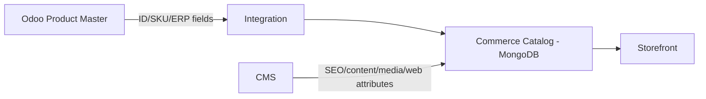

# Data Ownership Matrix

**Trạng thái:** Draft - cần xác nhận trước khi khóa SRS integration.

## 1. Mục tiêu

Xác định hệ thống nào là source of truth cho từng nhóm dữ liệu và hệ thống nào chỉ được đọc, enrich hoặc đồng bộ bản sao. Việc dùng MongoDB ở Commerce và PostgreSQL ở Odoo không tự tạo xung đột; xung đột xảy ra khi ownership và quyền ghi không rõ.

## 2. Ma trận ban đầu

| Nhóm dữ liệu | Odoo | Commerce/CMS | Storefront | Source of truth đề xuất | Trạng thái |
| --- | --- | --- | --- | --- | --- |
| SKU / mã sản phẩm | Có | Có bản đại diện | Đọc | Odoo | Giả định cần xác nhận |
| Barcode | Có | Có thể đồng bộ | Đọc khi cần | Odoo | Giả định cần xác nhận |
| Tồn kho thực tế | Quản lý | Cache/đồng bộ nếu cần | Đọc trạng thái khả dụng | Odoo | Giả định cần xác nhận |
| Warehouse | Quản lý | Đọc khi cần | Không trực tiếp | Odoo | Giả định cần xác nhận |
| Stock movement | Quản lý | Không ghi trực tiếp | Không | Odoo | Giả định cần xác nhận |
| Reservation | Quản lý | Gửi yêu cầu/nhận trạng thái | Gián tiếp qua order | Odoo | Giả định cần xác nhận |
| Tên hiển thị website | Có thể có | Quản lý | Đọc | Commerce/CMS | Giả định cần xác nhận |
| Slug/SEO | Không yêu cầu ERP | Quản lý | Đọc | Commerce/CMS | Giả định cần xác nhận |
| Gallery/media | Không yêu cầu ERP | Quản lý | Đọc | Commerce/CMS | Giả định cần xác nhận |
| Thuộc tính linh hoạt | Có thể có tập ERP riêng | Quản lý web-facing attributes | Đọc | Commerce/CMS | Đã xác nhận về nhu cầu linh hoạt; ownership chưa chốt |
| Giá cơ sở | Có | Có thể đồng bộ | Đọc | TBD | Câu hỏi mở Q-002 |
| Promotion rule | Có custom | Có phần commerce/presentation | Đọc kết quả | TBD | Câu hỏi mở Q-003 |
| Order | Có | Có | Xem/tạo | TBD | Câu hỏi mở Q-004 |
| Warranty | Quản lý nghiệp vụ | Có thể hiển thị/hỗ trợ | TBD | Odoo | Giả định cần xác nhận |
| Store/location | Có | Có thể enrich nội dung | Đọc | Odoo hoặc split ownership | Câu hỏi mở Q-008 |
| Staff role/permission | Quản lý quyền Odoo | Quản lý quyền CMS | Không áp dụng | Tách theo hệ thống | Giả định cần xác nhận |

## 3. Quy tắc cần xác nhận

### RULE-DATA-001

Mỗi field quan trọng phải có một authoritative writer. Các hệ thống còn lại chỉ được đọc, đồng bộ hoặc enrich theo phạm vi đã định nghĩa.

### RULE-DATA-002

Nếu một business entity được lưu ở cả MongoDB và PostgreSQL, phải có khóa liên kết ổn định như `odoo_product_id`, `sku` hoặc identifier khác đã được chốt.

### RULE-DATA-003

Không cho phép cập nhật hai chiều một field nếu chưa định nghĩa conflict resolution, versioning và hành vi khi đồng bộ thất bại.

## 4. Ví dụ mô hình Product - chưa phê duyệt

Đây là phương án kiến trúc đề xuất, chưa phải requirement đã chốt.
