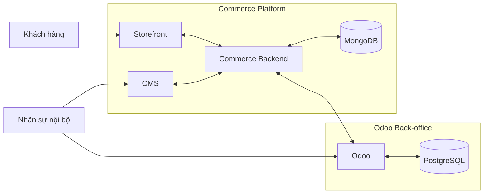

# System Context - BikeSport

**Trạng thái:** Draft

## 1. Bối cảnh hệ thống

## 2. Ranh giới trách nhiệm hiện tại

### Đã xác nhận

- Storefront phục vụ khách hàng mua sắm.
- CMS và Commerce Backend là hệ thống riêng với Odoo.
- MongoDB được dùng ở phía Commerce/CMS do dữ liệu thuộc tính sản phẩm cần linh hoạt.
- Odoo dùng PostgreSQL.
- Odoo thực hiện nhiều nghiệp vụ back-office ngoài tồn kho.

### Chưa xác nhận

- Storefront gọi trực tiếp Commerce Backend hay có lớp BFF/API Gateway.
- CMS có dùng cùng Commerce Backend với Storefront hay có API riêng.
- Odoo có bao nhiêu custom module và boundary từng module.
- Đồng bộ Odoo - Commerce là realtime, event-driven hay scheduled.
- Hệ thống nào có quyền tạo/sửa Product Master, Price, Promotion, Order và Store.

## 3. Nguyên tắc phân chia

1. Domain nghiệp vụ không đồng nhất với một database.
2. BRD/FRD mô tả năng lực nghiệp vụ xuyên hệ thống.
3. SRS tách theo ranh giới phần mềm: Storefront, Commerce Backend, CMS, Odoo Back-office.
4. Integration requirement mô tả dữ liệu và hành vi khi các hệ thống trao đổi với nhau.
5. Mỗi nhóm dữ liệu cần xác định một source of truth trước khi khóa thiết kế đồng bộ.

## 4. Domain map ban đầu

| Domain | Storefront | CMS | Commerce Backend | Odoo |
| --- | --- | --- | --- | --- |
| Product Catalog | Consume | Manage web-facing data | Serve/process | ERP-side product data TBD |
| Inventory | Display availability TBD | View TBD | Sync/serve TBD | Manage |
| Warehouse | - | - | Integration | Manage |
| Order | Create/display | Support view TBD | Process/integrate | Back-office processing |
| Pricing | Display | Manage presentation TBD | Calculate/serve TBD | Pricing source TBD |
| Promotion | Display | Content/presentation TBD | Apply TBD | Business rule source TBD |
| Warranty | Display/support TBD | View TBD | Integrate TBD | Manage |
| Store | Display | Content TBD | Serve/sync TBD | Manage/source TBD |
| Staff permission | Customer auth separate | Manage/check CMS access | Enforce API access | Manage/check Odoo access |

`TBD` nghĩa là chưa có đủ dữ kiện để chốt responsibility/source of truth.
