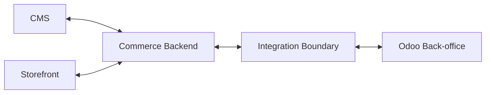

# INT - Odoo Commerce Integration

**Phiên bản:** 0.1  
**Trạng thái:** Draft

## 1. Mục tiêu

Định nghĩa ranh giới tích hợp giữa Commerce Backend và Odoo Back-office. Tài liệu này chưa khóa giao thức hay cơ chế đồng bộ khi chưa có quyết định kỹ thuật.

## 2. Integration Scope

| ID | Entity/Domain | Hướng dữ liệu | Trạng thái |
| --- | --- | --- | --- |
| IR-001 | Product master | Odoo <-> Commerce, ownership TBD | Cần xác nhận |
| IR-002 | Inventory/availability | Odoo -> Commerce | Giả định cần xác nhận |
| IR-003 | Warehouse | Odoo -> Commerce khi cần | Giả định cần xác nhận |
| IR-004 | Reservation | Commerce -> Odoo request; Odoo -> Commerce result/status | Giả định cần xác nhận |
| IR-005 | Order | Commerce <-> Odoo | Đã xác nhận ở mức khái niệm |
| IR-006 | Pricing | Hướng TBD | Câu hỏi mở |
| IR-007 | Promotion | Hướng/rule owner TBD | Câu hỏi mở |
| IR-008 | Warranty | Odoo -> Commerce nếu cần hiển thị/hỗ trợ | Giả định cần xác nhận |
| IR-009 | Store/location | Odoo -> Commerce hoặc split ownership | Câu hỏi mở |
| IR-010 | Multi-site configuration/data | Odoo <-> Commerce tùy nhóm dữ liệu | Đã xác nhận ở mức khái niệm |

## 3. Context Flow

## 4. Contract cần mô tả cho từng IR

Mỗi integration requirement khi được chi tiết hóa phải có:

- Source system và target system.
- Owner của entity/field.
- Trigger hoặc schedule.
- Payload và field mapping.
- Identifier/correlation key.
- Validation.
- Authentication/authorization nếu đã quyết định.
- Sync hay async.
- Idempotency/duplicate handling.
- Timeout/retry.
- Ordering nếu có event phụ thuộc thứ tự.
- Hành vi khi Odoo hoặc Commerce unavailable.
- Logging/audit.
- Reconciliation.
- Versioning/backward compatibility.

## 5. Failure Scenarios cần chốt

| ID | Tình huống | Hành vi hiện tại |
| --- | --- | --- |
| IF-001 | Commerce gửi order nhưng Odoo không khả dụng | TBD |
| IF-002 | Odoo reserve thất bại do hết hàng | TBD |
| IF-003 | Stock thay đổi trong lúc checkout | TBD |
| IF-004 | Product tồn tại ở Odoo nhưng chưa có Commerce representation | TBD |
| IF-005 | Commerce nhận cùng một event/update nhiều lần | TBD |
| IF-006 | Giá/promotion ở hai hệ thống không đồng nhất | TBD |
| IF-007 | Một website sync thành công, website khác thất bại | TBD |

## 6. Open Questions ưu tiên cao

1. Product Master được tạo ở đâu?
2. Order authoritative state nằm ở đâu theo từng giai đoạn?
3. Reservation xảy ra khi add-to-cart, checkout hay sau khi order được xác nhận?
4. Tồn kho Commerce cần chính xác tức thời đến mức nào?
5. Pricing/promotion rule nào do Odoo tính, rule nào do Commerce tính?
6. Cơ chế đồng bộ hiện tại/dự kiến là gì?
7. Có yêu cầu manual reconciliation/replay không?
