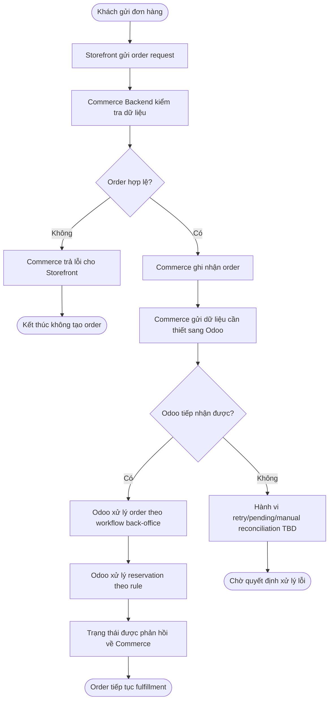

# FLOW-001 - Order to Fulfillment

**Trạng thái:** Draft - luồng khái niệm, chưa dùng làm baseline triển khai.

## 1. Mục tiêu

Mô tả luồng xuyên Storefront, Commerce Backend và Odoo từ lúc khách tạo đơn đến lúc Odoo tiếp nhận xử lý vận hành.

## 2. Điểm bắt đầu / kết thúc

- **Bắt đầu:** khách hàng gửi yêu cầu đặt hàng trên Storefront.
- **Kết thúc thành công ban đầu:** order được Commerce ghi nhận và Odoo tiếp nhận theo integration đã định nghĩa.
- **Kết thúc fulfillment đầy đủ:** chưa đủ dữ kiện về đóng gói, giao hàng, thanh toán và hoàn tất đơn.

## 3. Flow khái niệm

## 4. Mapping requirement

| Bước | Requirement liên quan |
| --- | --- |
| Storefront tạo order | FR-020 / SF-FR-003 |
| Commerce xử lý order | BE-FR-004 |
| Commerce - Odoo exchange | FR-021 / IR-005 |
| Odoo tiếp nhận order | OD-FR-010 |
| Reservation | FR-013 / OD-FR-005 / IR-004 |

## 5. Câu hỏi mở

- Q-FLOW-001: Commerce ghi order trước hay chỉ ghi sau khi Odoo accept?
- Q-FLOW-002: Reservation xảy ra ở bước nào?
- Q-FLOW-003: Payment xảy ra trước hay sau khi gửi Odoo?
- Q-FLOW-004: Nếu Odoo unavailable thì order ở trạng thái nào?
- Q-FLOW-005: Có cơ chế cancel/rollback reservation không?
- Q-FLOW-006: Fulfillment có pickup-at-store không?
- Q-FLOW-007: Warehouse nào fulfill order được xác định bằng rule nào?

Do các câu hỏi trên chưa có câu trả lời, flow này không được coi là TO-BE đã phê duyệt.
