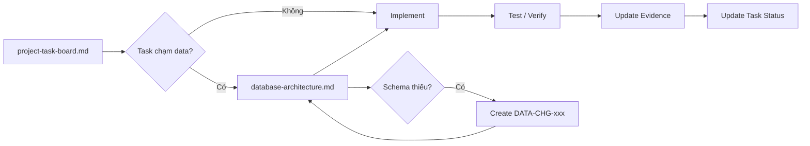

# BikeSport Engineering Execution Documents

**Trạng thái:** Draft  
**Phạm vi:** theo dõi việc triển khai BikeSport và giữ kiến trúc giữa các agent nhất quán.

## Tài liệu chính

| File | Dùng để làm gì |
| --- | --- |
| `project-task-board.md` | Danh sách task thật theo phase/subsystem, dependency, status, Done condition và evidence |
| `database-architecture.md` | **Canonical database schema**: từng MongoDB collection, từng Odoo model/PostgreSQL table, field, type, index, relation và cross-database mapping |
| `storefront-design-system.md` | Design token, component contract và task Design System/Storefront |

## Quy tắc bắt buộc

### Khi nhận task

Agent phải đọc `project-task-board.md`, tìm đúng task ID và dependency của task đó.

Nếu task chạm Product, Category, Inventory, Pricing, Promotion, Cart, Order, Store, Warranty, Sync hoặc Odoo model thì **phải đọc `database-architecture.md` trước khi code**.

### Database schema

`database-architecture.md` là schema baseline canonical của project.

Agent **không được**:

- tự tạo collection MongoDB khác tên;
- tự tạo bảng/model Odoo khác tên;
- tự thêm root field vào document;
- đổi type/nullability/index/relationship;
- tự tách một collection thành nhiều collection;
- tạo duplicate representation của cùng entity để tiện task hiện tại.

Nếu schema hiện tại không đủ, phải tạo task `DATA-CHG-xxx`, sửa schema baseline trước, sau đó mới implement.

### Theo dõi hoàn thành

Một task chỉ được `DONE` khi có evidence tương ứng trong task board: commit, test result, benchmark, screenshot hoặc tài liệu quyết định tùy loại task.

Không được coi việc "đã viết code" là đủ nếu Done condition còn test/integration/security/performance chưa đạt.

## Luồng làm việc

## Trạng thái hiện tại

- Task board: đã chia task theo subsystem và phase, đang ở Draft/Review.
- Database schema: đã có canonical draft với exact collection/table/field/index; các quyết định ownership còn phải chốt qua `DEC-*`.
- Storefront Design System: đang Draft, token value chưa chốt.
- Implementation: chưa bắt đầu trong repository này.
