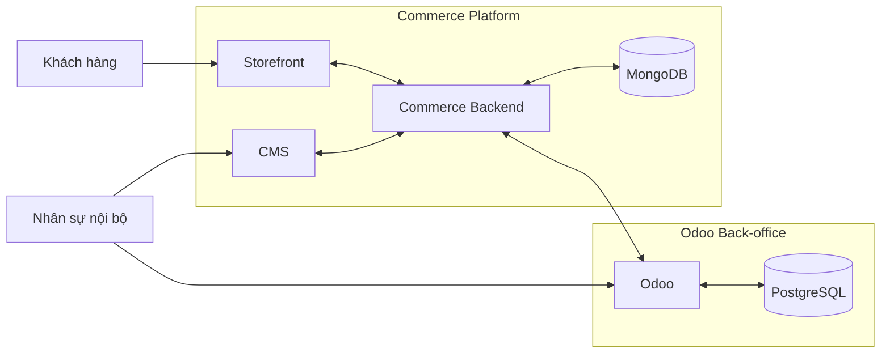

# Architecture Blueprint

**Trạng thái:** Draft  
**Lưu ý:** tài liệu này mô tả logical architecture dựa trên thông tin đã có. Các chi tiết triển khai chưa được xác nhận được ghi `TBD` hoặc `Proposed`.

## 1. System landscape

## 2. Responsibility boundary

| Subsystem | Trách nhiệm chính | Không nên tự sở hữu |
| --- | --- | --- |
| Storefront | Customer-facing experience và hành vi mua sắm | ERP transaction logic, warehouse mutation |
| CMS | Nội dung và dữ liệu presentation thuộc Commerce | Stock transaction/reservation nếu ownership thuộc Odoo |
| Commerce Backend | API/application logic, Commerce persistence, integration orchestration | Tự thay đổi ERP rule không có requirement |
| Odoo Back-office | Nghiệp vụ vận hành nội bộ như stock, warehouse, order back-office, warranty, store, staff permission theo scope đã xác nhận | UI/content presentation của Storefront |

## 3. Domain to subsystem map

| Domain | Storefront | CMS | Commerce Backend | Odoo |
| --- | --- | --- | --- | --- |
| Product Catalog | Read/display | Manage web-facing fields | Serve/persist/sync | ERP-side product data TBD |
| Pricing | Display | Presentation TBD | Serve/calculate TBD | Source/rule TBD |
| Promotion | Display | Content/presentation TBD | Apply/serve TBD | Business rule TBD |
| Inventory | Display availability | View TBD | Read/sync/serve | Manage |
| Warehouse | - | - | Integrate | Manage |
| Order | Create/view | Support view TBD | Create/orchestrate/integrate | Back-office lifecycle |
| Warranty | Customer-facing TBD | Support TBD | Integrate | Manage |
| Store/Location | Display | Content TBD | Serve/sync | Manage/source TBD |
| Staff permission | Customer auth separate | CMS authorization | API authorization | Odoo authorization |

## 4. Integration boundary

Các contract Commerce - Odoo cần mô tả tối thiểu:

- entity/data exchanged;
- source và destination;
- event/trigger;
- direction;
- identifier mapping;
- validation;
- duplicate/idempotency behavior khi áp dụng;
- timeout/retry behavior khi đã được quyết định;
- failure state;
- reconciliation;
- logging/audit;
- version compatibility.

Chưa có đủ dữ kiện để khóa đồng bộ là realtime, scheduled hay event-driven.

## 5. Architecture decisions cần quản lý

Mỗi quyết định kiến trúc có ảnh hưởng rộng nên được ghi thành ADR hoặc decision record riêng.

Các decision hiện cần chốt:

| ID | Quyết định | Trạng thái |
| --- | --- | --- |
| ADR-TBD-001 | Product Master source of truth | Open |
| ADR-TBD-002 | Pricing source/calculation authority | Open |
| ADR-TBD-003 | Promotion rule authority | Open |
| ADR-TBD-004 | Order system-of-record và lifecycle ownership | Open |
| ADR-TBD-005 | Commerce-Odoo synchronization mechanism | Open |
| ADR-TBD-006 | Storefront/CMS có dùng chung Commerce API hay tách contract | Open |

Không agent nào được khóa các quyết định này trong code mà không cập nhật decision record và tài liệu liên quan.
