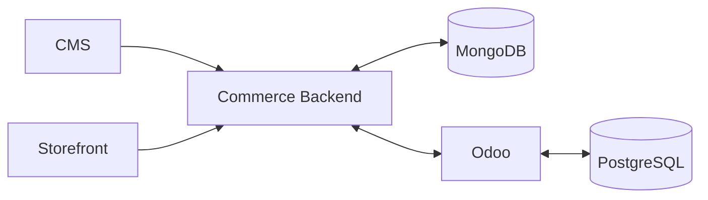
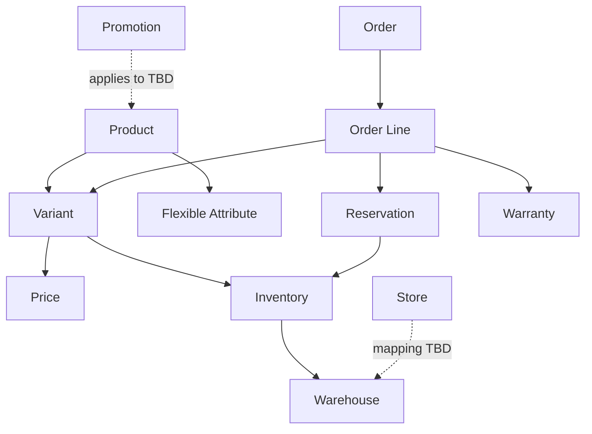

# Data Architecture

**Trạng thái:** Draft  
**Mục tiêu:** mô tả cách dữ liệu được phân chia giữa Commerce/MongoDB và Odoo/PostgreSQL, entity nào cần ownership rõ ràng và agent phải kiểm tra gì trước khi thay đổi schema.

## 1. Data landscape hiện tại

### Đã xác nhận

- Commerce/CMS sử dụng MongoDB cho dữ liệu có cấu trúc linh hoạt, đặc biệt thuộc tính sản phẩm và nội dung web.
- Odoo sử dụng PostgreSQL cho dữ liệu back-office/ERP.
- Hai hệ thống cần trao đổi một số dữ liệu dùng chung.

### Chưa xác nhận

- Product Master source of truth.
- Pricing authority.
- Promotion authority.
- Order system of record.
- Cơ chế đồng bộ.
- Identifier mapping chuẩn giữa MongoDB và Odoo.

## 2. Logical data domains

| Domain | Commerce/MongoDB | Odoo/PostgreSQL | Ownership hiện tại |
| --- | --- | --- | --- |
| Product presentation | Có | Có thể có subset | Commerce nghiêng về presentation, cần chốt |
| Flexible attributes | Có | Có thể có ERP attributes | Chưa khóa |
| SEO/media/content | Có | Không cần nếu không có nghiệp vụ | Commerce/CMS |
| SKU/Product master | Có reference | Có | TBD |
| Inventory | Có thể cache/read model | Có transaction | Odoo nghiêng về source, cần xác nhận |
| Warehouse/stock movement | Không nên sở hữu transaction | Có | Odoo |
| Reservation | Có thể đọc trạng thái | Có transaction | Odoo |
| Pricing | Có thể cache/display | Có thể quản lý rule | TBD |
| Promotion | Có presentation | Có thể có business rule | TBD |
| Order | Có customer-facing/order orchestration | Có back-office lifecycle | TBD system-of-record |
| Warranty | Có thể hiển thị/support | Có | Odoo nghiêng về management, cần chốt |
| Store/location | Có display data | Có operational data | TBD |

## 3. Nguyên tắc schema

1. Mỗi entity/domain dùng chung phải xác định `System of Record` trước khi cho phép ghi hai chiều.
2. Read model/cache không được mặc định xem là source of truth.
3. Dữ liệu MongoDB linh hoạt không có nghĩa schema-free: collection vẫn phải có validation contract, versioning và migration strategy khi cấu trúc thay đổi.
4. Dữ liệu PostgreSQL/Odoo phải tôn trọng model nghiệp vụ và transaction boundary của Odoo.
5. Identifier giữa hai hệ thống phải có mapping ổn định; không dựa vào display name để đồng bộ.
6. Schema change ảnh hưởng integration phải cập nhật contract và compatibility plan.

## 4. Logical entity model cần hoàn thiện

Sơ đồ trên chỉ thể hiện các quan hệ nghiệp vụ cần phân tích tiếp, chưa phải physical database schema.

## 5. Schema change checklist cho agent

Trước khi thay đổi schema/model, agent phải xác nhận:

- Entity thuộc subsystem nào?
- Ai là source of truth?
- Có downstream consumer nào?
- API/event contract nào bị ảnh hưởng?
- Có cần migration/backfill không?
- Có dữ liệu cũ không tương thích không?
- Có unique/index/constraint nào cần thay đổi không?
- Có ảnh hưởng performance/query pattern không?
- Có dữ liệu nhạy cảm cần bảo vệ/audit không?
- Có rollback plan không?

Nếu chưa trả lời được các câu trên, task schema không được coi là `Ready`.
