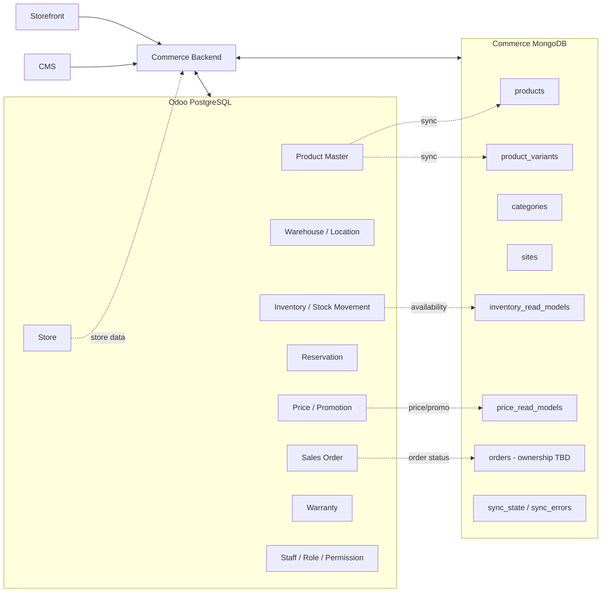
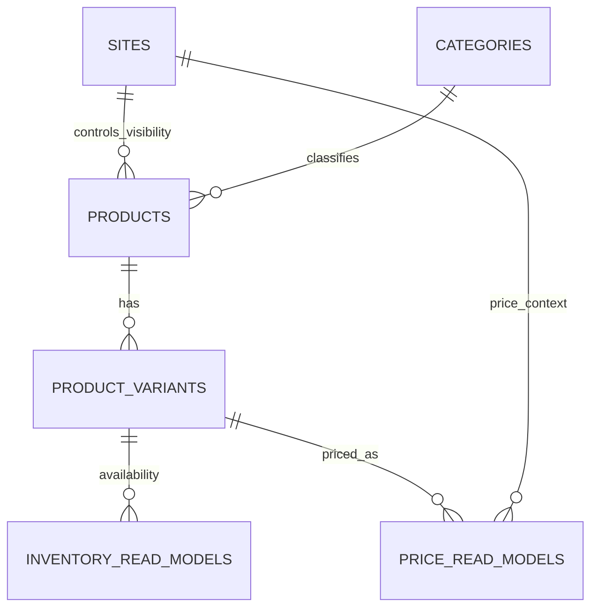
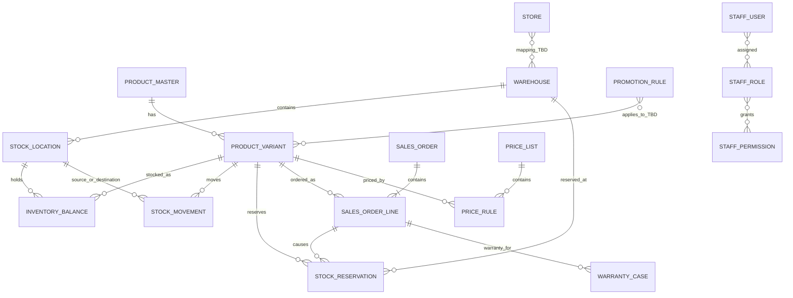
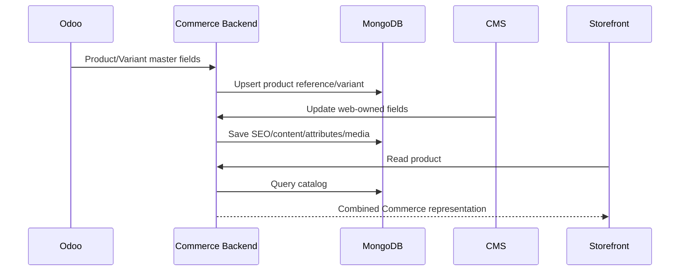
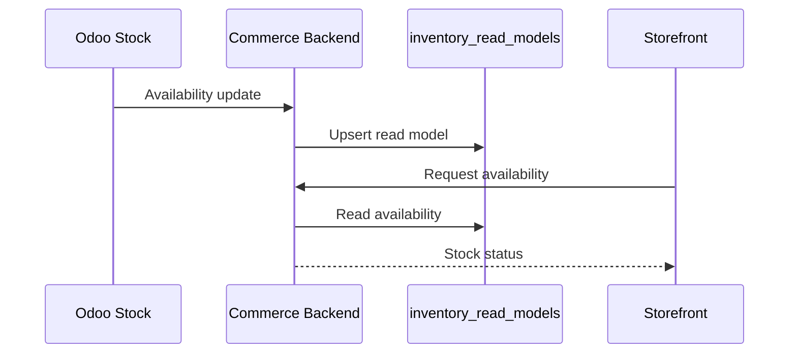
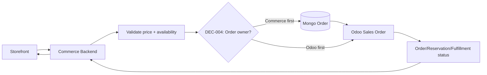

# BikeSport Database Architecture

**Trạng thái:** Proposed - dùng để triển khai sau khi các quyết định `DEC-*` được chốt.  
**Phạm vi:** Commerce MongoDB + Odoo PostgreSQL + mapping giữa hai hệ thống.

## 1. Mục tiêu

BikeSport có hai vùng dữ liệu khác nhau:

- **Commerce/MongoDB:** dữ liệu phục vụ website/CMS, đặc biệt catalog, nội dung, thuộc tính linh hoạt và read model cần đọc nhanh.
- **Odoo/PostgreSQL:** dữ liệu vận hành/back-office như warehouse, stock transaction, reservation, order fulfillment, warranty, staff permission và các rule ERP.

Hai database không được xem như hai bản copy ngang quyền. Mỗi field dùng chung phải có một authoritative writer.

## 2. Kiến trúc dữ liệu tổng thể



## 3. MongoDB - Commerce logical schema

### 3.1 `products`

Dùng cho dữ liệu hiển thị cấp product và thuộc tính linh hoạt.

```json
{
  "_id": "ObjectId",
  "odoo_template_id": "TBD",
  "product_code": "TBD",
  "slug": "string",
  "name": "string",
  "status": "draft|published|archived",
  "category_ids": ["ObjectId"],
  "attributes": {
    "frame_material": "Aluminum",
    "wheel_size": "27.5",
    "fork_travel": "100mm"
  },
  "seo": {
    "title": "string",
    "description": "string"
  },
  "media": [],
  "site_visibility": [],
  "created_at": "datetime",
  "updated_at": "datetime"
}
```

**Ownership dự kiến:**

- `slug`, `name hiển thị`, `attributes web`, `seo`, `media`, `site_visibility`: Commerce/CMS.
- `odoo_template_id`, Product Master fields: phụ thuộc `DEC-001`.

### 3.2 `product_variants`

Variant phải có identifier ổn định để map stock/price/order.

```json
{
  "_id": "ObjectId",
  "product_id": "ObjectId",
  "odoo_variant_id": "TBD",
  "sku": "string",
  "barcode": "TBD",
  "options": {
    "size": "M",
    "color": "black"
  },
  "status": "active|inactive",
  "created_at": "datetime",
  "updated_at": "datetime"
}
```

**Index dự kiến:**

- unique `sku` nếu `DEC-001` xác nhận SKU là unique toàn hệ thống;
- `odoo_variant_id` unique nếu Odoo là Product Master;
- `product_id` để lấy variants theo product.

### 3.3 `categories`

```json
{
  "_id": "ObjectId",
  "parent_id": "ObjectId|null",
  "slug": "string",
  "name": "string",
  "path": "string",
  "sort_order": 0,
  "site_visibility": []
}
```

### 3.4 `sites`

Phục vụ multi-site/channel.

```json
{
  "_id": "ObjectId",
  "site_code": "string",
  "name": "string",
  "domain": "string",
  "status": "active|inactive",
  "settings": {}
}
```

### 3.5 `inventory_read_models`

Không phải transaction stock. Đây chỉ là bản đọc phục vụ Commerce.

```json
{
  "variant_id": "ObjectId",
  "odoo_variant_id": "TBD",
  "store_id": "TBD",
  "warehouse_id": "TBD",
  "available_qty": "number",
  "stock_status": "in_stock|low_stock|out_of_stock|TBD",
  "source_version": "TBD",
  "synced_at": "datetime"
}
```

**Source of truth dự kiến:** Odoo. Commerce không được tự tạo stock transaction từ collection này.

### 3.6 `price_read_models`

```json
{
  "variant_id": "ObjectId",
  "site_id": "ObjectId",
  "price_list_id": "TBD",
  "base_price": "number",
  "selling_price": "number",
  "currency": "string",
  "promotion_refs": [],
  "valid_from": "datetime|null",
  "valid_to": "datetime|null",
  "synced_at": "datetime"
}
```

**Chưa khóa:** authoritative writer phụ thuộc `DEC-002` và `DEC-003`.

### 3.7 `orders`

Chỉ khóa physical schema sau `DEC-004`.

Nếu Commerce tạo order trước rồi mới gửi Odoo, collection tối thiểu cần:

```json
{
  "_id": "ObjectId",
  "order_number": "string",
  "odoo_order_id": "TBD",
  "customer": {},
  "items": [],
  "pricing_snapshot": {},
  "status": "TBD",
  "integration_status": "pending|synced|failed",
  "created_at": "datetime",
  "updated_at": "datetime"
}
```

Nếu Odoo là nơi tạo order chính thức trước, cấu trúc này phải đổi thành read model/reference. Vì vậy task `BE-012` đang bị block bởi `DEC-004`.

### 3.8 `sync_state` / `sync_errors`

Dùng để theo dõi integration, không thay thế dữ liệu nghiệp vụ.

```json
{
  "domain": "product|inventory|price|order|store|warranty",
  "source_id": "string",
  "target_id": "string|null",
  "event_key": "string",
  "status": "pending|processed|failed",
  "attempts": 0,
  "last_error": "string|null",
  "updated_at": "datetime"
}
```

## 4. MongoDB relationship



`attributes` không tách thành bảng cố định vì mục tiêu đã xác nhận là hỗ trợ bộ thuộc tính khác nhau theo loại sản phẩm.

## 5. Odoo/PostgreSQL - Logical domain schema

Tên dưới đây là **logical entity**, không khẳng định tên physical table Odoo. Khi implement, agent phải map sang standard model hoặc custom model phù hợp.



### 5.1 Odoo logical entities

| Entity | Trách nhiệm |
| --- | --- |
| `PRODUCT_MASTER` | ERP-facing product master, ownership chờ `DEC-001` |
| `PRODUCT_VARIANT` | SKU/variant dùng cho stock/order |
| `WAREHOUSE` | Kho |
| `STOCK_LOCATION` | Vị trí trong kho/cửa hàng nếu model yêu cầu |
| `INVENTORY_BALANCE` | Tồn tại một location/variant tại một thời điểm |
| `STOCK_MOVEMENT` | Nhập/xuất/chuyển kho |
| `STOCK_RESERVATION` | Hàng đã giữ cho order/process |
| `SALES_ORDER` | Order back-office, quyền sở hữu chờ `DEC-004` |
| `SALES_ORDER_LINE` | Dòng sản phẩm trong order |
| `PRICE_LIST`/`PRICE_RULE` | Pricing, ownership chờ `DEC-002` |
| `PROMOTION_RULE` | Promotion business rule, ownership chờ `DEC-003` |
| `STORE` | Cửa hàng/địa điểm |
| `WARRANTY_CASE` | Bảo hành, key chờ `DEC-007` |
| `STAFF_USER/ROLE/PERMISSION` | Quyền truy cập back-office |

## 6. Cross-database identity

Không join MongoDB với PostgreSQL bằng display name.

### Mapping đề xuất

| Domain | MongoDB | Odoo | Trạng thái |
| --- | --- | --- | --- |
| Product | `odoo_template_id` | Product Master ID | Chờ DEC-001/009 |
| Variant | `odoo_variant_id`, `sku` | Variant ID, SKU | Chờ DEC-001/009 |
| Store | `odoo_store_id` hoặc `store_code` | Store ID/code | Chờ DEC-008/009 |
| Warehouse | `odoo_warehouse_id` | Warehouse ID | Chờ DEC-008/009 |
| Order | `odoo_order_id` | Sales Order ID | Chờ DEC-004/009 |
| Warranty | `odoo_warranty_id` | Warranty ID | Chờ DEC-007/009 |

## 7. Data flow theo domain

### Product



Luồng này chỉ trở thành chính thức khi `DEC-001` và `DEC-005` được chốt.

### Inventory



Commerce read model không được dùng để ghi ngược stock movement.

### Order



## 8. Task nào được phép thay đổi schema nào

| Task prefix | Được thay đổi |
| --- | --- |
| `DATA-*` | Schema/ownership/identifier contract |
| `ODOO-*` | Odoo logical/physical model thuộc task đó |
| `BE-*` | MongoDB collections/indexes thuộc Commerce |
| `CMS-*` | Không tự thay schema; phải phụ thuộc `BE-*`/`DATA-*` nếu cần field mới |
| `SF-*` | Không được thay database schema trực tiếp |
| `INT-*` | Integration payload/mapping; thay schema cần liên kết `DATA-*` |

## 9. Các điểm chưa được phép khóa physical schema

- Product Master ownership.
- Pricing source of truth.
- Promotion calculation ownership.
- Order system of record.
- Warranty key.
- Store-Warehouse mapping.
- Cross-system identifiers.
- Sync mechanism/versioning.

Các điểm này tương ứng `DEC-001` đến `DEC-010` trong `project-task-board.md`.
