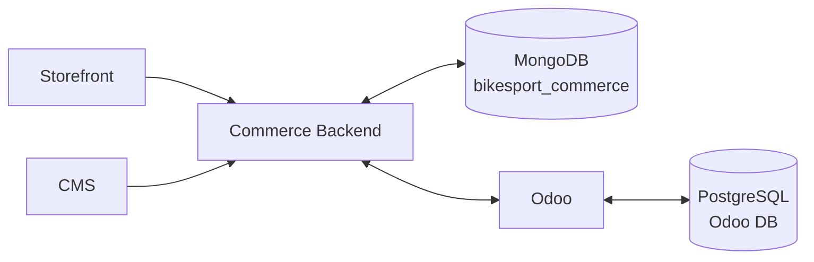

# BikeSport Database Architecture Index

Tài liệu database đã được **tách theo physical data store** để agent không nhầm MongoDB với PostgreSQL/Odoo và không tự phát sinh schema khác nhau giữa các task.

## Canonical sources

| Phạm vi | Tài liệu canonical |
| --- | --- |
| Commerce/CMS MongoDB | [`database/mongodb-schema.md`](./database/mongodb-schema.md) |
| Odoo/PostgreSQL | [`database/odoo-postgresql-schema.md`](./database/odoo-postgresql-schema.md) |
| Mapping MongoDB ↔ Odoo | [`database/cross-system-mapping.md`](./database/cross-system-mapping.md) |
| Quy tắc sử dụng | [`database/README.md`](./database/README.md) |

## Boundary

**Không có physical table/collection nào dùng chung giữa MongoDB và PostgreSQL.**

Các entity như Product, Order, Price, Inventory có thể có representation ở cả hai bên nhưng phải được nối bằng identifier mapping và integration contract; không phải dùng chung bảng.

## Rule bắt buộc

- Task `BE-*` / `CMS-*` phải đọc `mongodb-schema.md`.
- Task `ODOO-*` phải đọc `odoo-postgresql-schema.md`.
- Task `INT-*` phải đọc cả hai schema và `cross-system-mapping.md`.
- Task `SF-*` không được sửa database schema trực tiếp.
- Muốn thêm/xóa/đổi collection/table/field/index/relation phải tạo `DATA-CHG-xxx` và cập nhật đúng schema file trước khi implement.

File này chỉ là **index kiến trúc**, không còn là nơi định nghĩa field-level schema.