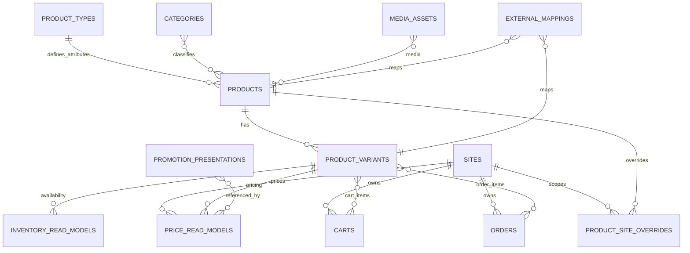
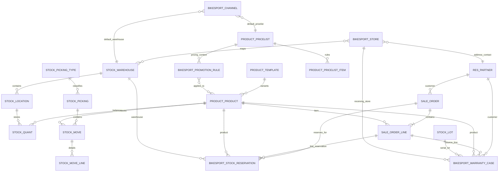
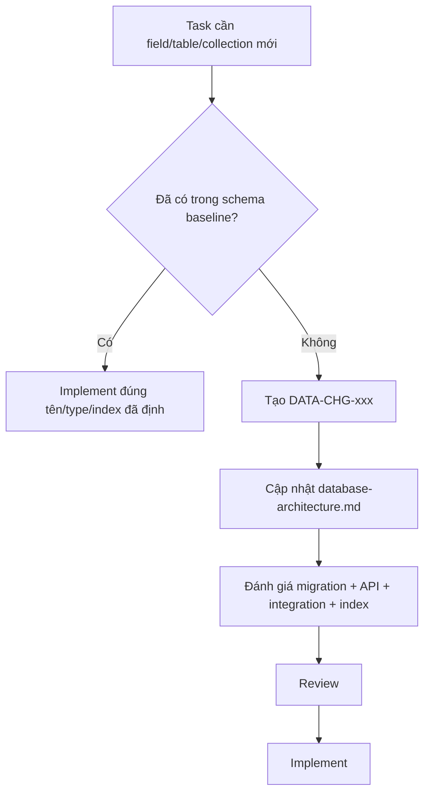

# BikeSport Database Schema Baseline

**Trạng thái:** Canonical Draft - bắt buộc dùng làm baseline cho mọi task cho đến khi tài liệu này được sửa bằng một task thay đổi schema.  
**Phạm vi:** Commerce MongoDB + Odoo PostgreSQL + mapping giữa hai hệ thống.  
**Mục tiêu:** không để mỗi agent tự tạo collection, bảng, field hoặc quan hệ theo cách riêng.

## 1. Quy tắc bắt buộc cho agent

1. Không được tạo collection MongoDB mới nếu collection đó chưa có trong tài liệu này.
2. Không được tạo Odoo custom model/table mới nếu model/table đó chưa có trong tài liệu này.
3. Không được đổi tên field, đổi type, tách/nhập collection hoặc thay relation mà không cập nhật tài liệu schema trước.
4. Mọi thay đổi schema phải có task `DATA-CHG-xxx`, nêu migration, index, backward compatibility và các API/integration bị ảnh hưởng.
5. `products.attributes` là vùng dữ liệu linh hoạt duy nhất ở Product Catalog, nhưng key hợp lệ phải được khai báo trong `product_types.attribute_definitions`. Agent không được tự nhét field mới vào root document.
6. Read model trong MongoDB không được dùng làm nguồn ghi ngược cho transaction Odoo.
7. Tên collection, model, table và field trong tài liệu này là canonical. Nếu code khác tài liệu thì code phải được sửa hoặc tài liệu phải được thay đổi có chủ đích; không tồn tại hai schema song song.

> Các quyết định source of truth như Product/Pricing/Promotion/Order vẫn còn `DEC-*`. Điều đó không cho phép agent tự đổi cấu trúc schema. Khi quyết định thay đổi ownership, cập nhật writer/read path nhưng giữ schema nếu không có lý do phải đổi.

---

# 2. Database landscape

```mermaid
flowchart LR
    SF[Storefront]
    CMS[CMS]
    BE[Commerce Backend]

    subgraph MONGO[MongoDB - bikesport_commerce]
        M1[sites]
        M2[product_types]
        M3[categories]
        M4[products]
        M5[product_variants]
        M6[media_assets]
        M7[product_site_overrides]
        M8[inventory_read_models]
        M9[price_read_models]
        M10[promotion_presentations]
        M11[carts]
        M12[orders]
        M13[external_mappings]
        M14[sync_checkpoints]
        M15[sync_failures]
    end

    subgraph PG[PostgreSQL - Odoo]
        P1[product_template / product_product]
        P2[stock_warehouse / stock_location]
        P3[stock_quant / stock_move / stock_move_line]
        P4[stock_picking / stock_picking_type]
        P5[sale_order / sale_order_line]
        P6[product_pricelist / product_pricelist_item]
        P7[res_partner]
        P8[res_users / res_groups / ir_model_access / ir_rule]
        P9[bikesport_store]
        P10[bikesport_stock_reservation]
        P11[bikesport_warranty_case]
        P12[bikesport_promotion_rule]
        P13[bikesport_channel]
    end

    SF --> BE
    CMS --> BE
    BE <--> MONGO
    BE <--> PG
```

---

# 3. MongoDB canonical collections

Database name đề xuất: `bikesport_commerce`.

## 3.1 `sites`

Một document đại diện một website/kênh storefront.

| Field | Type | Required | Ghi chú |
| --- | --- | --- | --- |
| `_id` | ObjectId | Yes | Primary identifier |
| `code` | string | Yes | Mã site ổn định, ví dụ `xedap` |
| `name` | string | Yes | Tên hiển thị |
| `domain` | string | Yes | Domain chính |
| `default_locale` | string | Yes | Locale mặc định |
| `default_currency` | string | Yes | ISO currency code |
| `status` | enum | Yes | `active`, `inactive` |
| `created_at` | datetime | Yes | UTC |
| `updated_at` | datetime | Yes | UTC |

**Indexes**

- unique `{ code: 1 }`
- unique `{ domain: 1 }`
- `{ status: 1 }`

---

## 3.2 `product_types`

Định nghĩa loại sản phẩm và schema thuộc tính linh hoạt. Đây là registry bắt buộc cho `products.attributes`.

| Field | Type | Required | Ghi chú |
| --- | --- | --- | --- |
| `_id` | ObjectId | Yes | Primary identifier |
| `code` | string | Yes | Ví dụ `bicycle`, `helmet`, `shoe` |
| `name` | string | Yes | Tên loại sản phẩm |
| `attribute_definitions` | array<object> | Yes | Danh sách thuộc tính được phép dùng |
| `attribute_definitions[].key` | string | Yes | Key duy nhất trong product type |
| `attribute_definitions[].label` | string | Yes | Nhãn hiển thị |
| `attribute_definitions[].data_type` | enum | Yes | `string`, `number`, `boolean`, `enum`, `multi_enum` |
| `attribute_definitions[].unit` | string|null | No | Ví dụ `mm`, `kg` |
| `attribute_definitions[].required` | boolean | Yes | Bắt buộc nhập hay không |
| `attribute_definitions[].filterable` | boolean | Yes | Có dùng filter storefront không |
| `attribute_definitions[].searchable` | boolean | Yes | Có đưa vào search index không |
| `attribute_definitions[].sortable` | boolean | Yes | Có cho phép sort không |
| `attribute_definitions[].allowed_values` | array<string> | No | Bắt buộc với enum nếu cần |
| `attribute_definitions[].sort_order` | integer | Yes | Thứ tự hiển thị |
| `status` | enum | Yes | `active`, `inactive` |
| `created_at` | datetime | Yes | UTC |
| `updated_at` | datetime | Yes | UTC |

**Indexes**

- unique `{ code: 1 }`
- `{ status: 1 }`

**Rule:** agent muốn thêm `frame_material` phải thêm definition vào `product_types` trước; không được tự thêm root field `frame_material` vào `products`.

---

## 3.3 `categories`

| Field | Type | Required | Ghi chú |
| --- | --- | --- | --- |
| `_id` | ObjectId | Yes | Primary identifier |
| `parent_id` | ObjectId|null | No | Self reference |
| `code` | string | Yes | Mã category ổn định |
| `slug` | string | Yes | Slug mặc định |
| `name` | string | Yes | Tên mặc định |
| `path` | string | Yes | Materialized path, ví dụ `/bike/mtb` |
| `sort_order` | integer | Yes | Default `0` |
| `status` | enum | Yes | `active`, `inactive` |
| `created_at` | datetime | Yes | UTC |
| `updated_at` | datetime | Yes | UTC |

**Indexes**

- unique `{ code: 1 }`
- unique `{ slug: 1 }`
- `{ parent_id: 1, sort_order: 1 }`
- `{ path: 1 }`

---

## 3.4 `products`

Một document là product-level presentation. Variant/SKU nằm ở `product_variants`.

| Field | Type | Required | Ghi chú |
| --- | --- | --- | --- |
| `_id` | ObjectId | Yes | Primary identifier |
| `external_product_id` | string|null | No | ID Product Template phía Odoo sau khi DEC-009 chốt format |
| `product_type_id` | ObjectId | Yes | FK logic tới `product_types` |
| `code` | string | Yes | Commerce product code ổn định |
| `slug` | string | Yes | Slug mặc định |
| `name` | string | Yes | Tên hiển thị mặc định |
| `short_description` | string|null | No | Nội dung ngắn |
| `description` | string|null | No | Nội dung dài/rich text theo format backend chốt |
| `category_ids` | array<ObjectId> | Yes | Có thể rỗng |
| `attributes` | object | Yes | Dynamic keys nhưng phải khớp `product_types.attribute_definitions` |
| `media_ids` | array<ObjectId> | Yes | Tham chiếu `media_assets` |
| `status` | enum | Yes | `draft`, `published`, `archived` |
| `version` | integer | Yes | Optimistic/document version, bắt đầu `1` |
| `created_at` | datetime | Yes | UTC |
| `updated_at` | datetime | Yes | UTC |

**Indexes**

- unique `{ code: 1 }`
- unique `{ slug: 1 }`
- `{ product_type_id: 1 }`
- `{ category_ids: 1, status: 1 }`
- `{ status: 1, updated_at: -1 }`
- sparse `{ external_product_id: 1 }`

**Không được thêm root field tùy ý.** Ví dụ `wheel_size`, `frame_material`, `groupset` phải nằm trong `attributes`.

---

## 3.5 `product_variants`

Một document là một SKU/variant có thể gắn tồn kho, giá và order line.

| Field | Type | Required | Ghi chú |
| --- | --- | --- | --- |
| `_id` | ObjectId | Yes | Primary identifier |
| `product_id` | ObjectId | Yes | Ref `products` |
| `external_variant_id` | string|null | No | ID Product Variant phía Odoo |
| `sku` | string | Yes | SKU canonical cho Commerce |
| `barcode` | string|null | No | Barcode nếu có |
| `option_values` | object | Yes | Ví dụ `{ "size": "M", "color": "black" }` |
| `status` | enum | Yes | `active`, `inactive` |
| `created_at` | datetime | Yes | UTC |
| `updated_at` | datetime | Yes | UTC |

**Indexes**

- unique `{ sku: 1 }`
- sparse unique `{ barcode: 1 }`
- sparse `{ external_variant_id: 1 }`
- `{ product_id: 1, status: 1 }`

---

## 3.6 `media_assets`

| Field | Type | Required | Ghi chú |
| --- | --- | --- | --- |
| `_id` | ObjectId | Yes | Primary identifier |
| `asset_key` | string | Yes | Key storage ổn định |
| `type` | enum | Yes | `image`, `video`, `document` |
| `url` | string | Yes | Public/served URL |
| `alt_text` | string|null | No | Accessibility/SEO |
| `width` | integer|null | No | Pixel |
| `height` | integer|null | No | Pixel |
| `mime_type` | string | Yes | MIME |
| `size_bytes` | integer | Yes | Kích thước file |
| `status` | enum | Yes | `active`, `deleted` |
| `created_at` | datetime | Yes | UTC |
| `updated_at` | datetime | Yes | UTC |

**Indexes**

- unique `{ asset_key: 1 }`
- `{ type: 1, status: 1 }`

---

## 3.7 `product_site_overrides`

Dùng khi cùng một Product có presentation khác theo website. Không clone toàn bộ `products`.

| Field | Type | Required | Ghi chú |
| --- | --- | --- | --- |
| `_id` | ObjectId | Yes | Primary identifier |
| `site_id` | ObjectId | Yes | Ref `sites` |
| `product_id` | ObjectId | Yes | Ref `products` |
| `visible` | boolean | Yes | Có hiển thị trên site không |
| `slug` | string|null | No | Override slug |
| `name` | string|null | No | Override tên |
| `short_description` | string|null | No | Override |
| `description` | string|null | No | Override |
| `seo_title` | string|null | No | SEO site-specific |
| `seo_description` | string|null | No | SEO site-specific |
| `media_ids` | array<ObjectId>|null | No | Override media nếu cần |
| `created_at` | datetime | Yes | UTC |
| `updated_at` | datetime | Yes | UTC |

**Indexes**

- unique `{ site_id: 1, product_id: 1 }`
- sparse unique `{ site_id: 1, slug: 1 }`
- `{ site_id: 1, visible: 1 }`

---

## 3.8 `inventory_read_models`

Read model từ Odoo. Không tạo stock transaction tại đây.

| Field | Type | Required | Ghi chú |
| --- | --- | --- | --- |
| `_id` | ObjectId | Yes | Primary identifier |
| `variant_id` | ObjectId | Yes | Ref `product_variants` |
| `external_variant_id` | string | Yes | Odoo variant ID/key |
| `store_key` | string|null | No | Store mapping key |
| `warehouse_key` | string | Yes | Warehouse mapping key |
| `on_hand_qty` | decimal | Yes | Tồn vật lý/read model |
| `reserved_qty` | decimal | Yes | Đã giữ |
| `available_qty` | decimal | Yes | Khả dụng bán |
| `stock_status` | enum | Yes | `in_stock`, `low_stock`, `out_of_stock` |
| `source_version` | string|null | No | Version/cursor nguồn |
| `source_updated_at` | datetime|null | No | Timestamp từ Odoo |
| `synced_at` | datetime | Yes | UTC |

**Indexes**

- unique `{ variant_id: 1, warehouse_key: 1 }`
- `{ store_key: 1, stock_status: 1 }`
- `{ external_variant_id: 1 }`
- `{ synced_at: 1 }`

---

## 3.9 `price_read_models`

| Field | Type | Required | Ghi chú |
| --- | --- | --- | --- |
| `_id` | ObjectId | Yes | Primary identifier |
| `site_id` | ObjectId | Yes | Ref `sites` |
| `variant_id` | ObjectId | Yes | Ref `product_variants` |
| `external_pricelist_id` | string|null | No | Pricelist Odoo nếu áp dụng |
| `currency` | string | Yes | ISO code |
| `list_price` | decimal | Yes | Giá niêm yết |
| `sale_price` | decimal | Yes | Giá bán hiệu lực |
| `discount_amount` | decimal | Yes | Default `0` |
| `promotion_ids` | array<string> | Yes | External/business promotion refs |
| `valid_from` | datetime|null | No | Hiệu lực |
| `valid_to` | datetime|null | No | Hiệu lực |
| `source_version` | string|null | No | Source version/cursor |
| `synced_at` | datetime | Yes | UTC |

**Indexes**

- unique `{ site_id: 1, variant_id: 1 }`
- `{ site_id: 1, sale_price: 1 }`
- `{ promotion_ids: 1 }`
- `{ synced_at: 1 }`

---

## 3.10 `promotion_presentations`

Chỉ chứa presentation/read data của promotion cho Commerce. Business calculation owner phụ thuộc `DEC-003`.

| Field | Type | Required | Ghi chú |
| --- | --- | --- | --- |
| `_id` | ObjectId | Yes | Primary identifier |
| `external_promotion_id` | string|null | No | ID rule nguồn nếu có |
| `code` | string | Yes | Promotion code |
| `name` | string | Yes | Tên |
| `label` | string|null | No | Badge/label storefront |
| `description` | string|null | No | Nội dung presentation |
| `site_ids` | array<ObjectId> | Yes | Site áp dụng |
| `priority` | integer | Yes | Default `0` |
| `valid_from` | datetime|null | No | Hiệu lực |
| `valid_to` | datetime|null | No | Hiệu lực |
| `status` | enum | Yes | `draft`, `active`, `expired`, `disabled` |
| `created_at` | datetime | Yes | UTC |
| `updated_at` | datetime | Yes | UTC |

**Indexes**

- unique `{ code: 1 }`
- sparse `{ external_promotion_id: 1 }`
- `{ site_ids: 1, status: 1, priority: -1 }`

---

## 3.11 `carts`

Cart là Commerce transaction ngắn hạn, không phải Odoo stock reservation record.

| Field | Type | Required | Ghi chú |
| --- | --- | --- | --- |
| `_id` | ObjectId | Yes | Primary identifier |
| `site_id` | ObjectId | Yes | Ref `sites` |
| `customer_key` | string|null | No | User/customer identity nếu có |
| `session_key` | string | Yes | Anonymous/authenticated cart key |
| `items` | array<object> | Yes | Cart lines |
| `items[].variant_id` | ObjectId | Yes | Ref variant |
| `items[].sku` | string | Yes | Snapshot identifier |
| `items[].quantity` | decimal | Yes | > 0 |
| `items[].unit_price_snapshot` | decimal | Yes | Giá tại lần tính gần nhất |
| `items[].promotion_ids` | array<string> | Yes | Applied refs |
| `currency` | string | Yes | ISO |
| `subtotal` | decimal | Yes | Snapshot |
| `discount_total` | decimal | Yes | Snapshot |
| `grand_total` | decimal | Yes | Snapshot |
| `expires_at` | datetime | Yes | Expiry |
| `created_at` | datetime | Yes | UTC |
| `updated_at` | datetime | Yes | UTC |

**Indexes**

- unique `{ session_key: 1 }`
- `{ customer_key: 1, updated_at: -1 }`
- TTL `{ expires_at: 1 }`

---

## 3.12 `orders`

Canonical Commerce representation của order. `DEC-004` quyết định đây là system-of-record hay local transaction + integration/read model, nhưng shape không được tự đổi theo từng agent.

| Field | Type | Required | Ghi chú |
| --- | --- | --- | --- |
| `_id` | ObjectId | Yes | Primary identifier |
| `order_number` | string | Yes | Commerce order number |
| `site_id` | ObjectId | Yes | Ref `sites` |
| `external_order_id` | string|null | No | Odoo Sales Order ID/key |
| `customer_key` | string|null | No | Customer identity nếu có |
| `customer_snapshot` | object | Yes | Snapshot tên/email/phone tối thiểu theo scope |
| `shipping_address` | object | Yes | Snapshot địa chỉ giao hàng |
| `billing_address` | object|null | No | Snapshot nếu khác shipping |
| `items` | array<object> | Yes | Immutable-ish order lines |
| `items[].line_key` | string | Yes | Line identifier |
| `items[].variant_id` | ObjectId | Yes | Ref variant |
| `items[].sku` | string | Yes | Snapshot SKU |
| `items[].name` | string | Yes | Snapshot name |
| `items[].quantity` | decimal | Yes | Số lượng |
| `items[].unit_price` | decimal | Yes | Snapshot |
| `items[].discount_amount` | decimal | Yes | Snapshot |
| `items[].line_total` | decimal | Yes | Snapshot |
| `currency` | string | Yes | ISO |
| `subtotal` | decimal | Yes | Snapshot |
| `discount_total` | decimal | Yes | Snapshot |
| `shipping_total` | decimal | Yes | Snapshot |
| `grand_total` | decimal | Yes | Snapshot |
| `status` | enum | Yes | `pending`, `confirmed`, `processing`, `completed`, `cancelled` |
| `integration_status` | enum | Yes | `pending`, `synced`, `failed` |
| `integration_error_code` | string|null | No | Lỗi sync gần nhất |
| `created_at` | datetime | Yes | UTC |
| `updated_at` | datetime | Yes | UTC |

**Indexes**

- unique `{ order_number: 1 }`
- sparse unique `{ external_order_id: 1 }`
- `{ customer_key: 1, created_at: -1 }`
- `{ site_id: 1, status: 1, created_at: -1 }`
- `{ integration_status: 1, updated_at: 1 }`

---

## 3.13 `external_mappings`

Cross-system identifier registry. Không map bằng display name.

| Field | Type | Required | Ghi chú |
| --- | --- | --- | --- |
| `_id` | ObjectId | Yes | Primary identifier |
| `entity_type` | enum | Yes | `product`, `variant`, `store`, `warehouse`, `order`, `warranty`, `promotion`, `pricelist` |
| `commerce_id` | string | Yes | ObjectId stringify hoặc canonical local key |
| `odoo_model` | string | Yes | Ví dụ `product.product` |
| `odoo_id` | integer | Yes | Odoo record ID |
| `external_key` | string|null | No | Stable business key nếu có |
| `created_at` | datetime | Yes | UTC |
| `updated_at` | datetime | Yes | UTC |

**Indexes**

- unique `{ entity_type: 1, commerce_id: 1 }`
- unique `{ odoo_model: 1, odoo_id: 1 }`
- sparse `{ entity_type: 1, external_key: 1 }`

---

## 3.14 `sync_checkpoints`

Theo dõi trạng thái đồng bộ theo domain, không chứa transaction nghiệp vụ.

| Field | Type | Required | Ghi chú |
| --- | --- | --- | --- |
| `_id` | ObjectId | Yes | Primary identifier |
| `domain` | enum | Yes | `product`, `inventory`, `price`, `promotion`, `order`, `store`, `warranty` |
| `direction` | enum | Yes | `odoo_to_commerce`, `commerce_to_odoo` |
| `cursor` | string|null | No | Cursor/version/timestamp tùy mechanism |
| `last_success_at` | datetime|null | No | Lần sync thành công |
| `last_run_at` | datetime|null | No | Lần chạy gần nhất |
| `status` | enum | Yes | `idle`, `running`, `failed` |
| `updated_at` | datetime | Yes | UTC |

**Indexes**

- unique `{ domain: 1, direction: 1 }`

---

## 3.15 `sync_failures`

| Field | Type | Required | Ghi chú |
| --- | --- | --- | --- |
| `_id` | ObjectId | Yes | Primary identifier |
| `domain` | enum | Yes | Cùng domain với checkpoint |
| `direction` | enum | Yes | Hướng sync |
| `source_key` | string | Yes | Record/event nguồn |
| `target_key` | string|null | No | Record đích nếu có |
| `payload_hash` | string|null | No | Dùng phát hiện cùng payload nếu cần |
| `error_code` | string | Yes | Stable error code |
| `error_message` | string | Yes | Chi tiết lỗi |
| `attempt_count` | integer | Yes | Bắt đầu `1` |
| `status` | enum | Yes | `open`, `retrying`, `resolved`, `ignored` |
| `first_failed_at` | datetime | Yes | UTC |
| `last_failed_at` | datetime | Yes | UTC |
| `resolved_at` | datetime|null | No | UTC |

**Indexes**

- `{ domain: 1, status: 1, last_failed_at: -1 }`
- `{ source_key: 1, status: 1 }`

---

# 4. MongoDB ERD

---

# 5. Odoo/PostgreSQL canonical model/table map

## 5.1 Standard Odoo models phải reuse

Agent không được tạo bảng custom thay thế cho các model chuẩn dưới đây nếu yêu cầu không bắt buộc.

| Domain | Odoo model | PostgreSQL table | Vai trò |
| --- | --- | --- | --- |
| Product template | `product.template` | `product_template` | Product-level ERP data |
| Product variant | `product.product` | `product_product` | SKU/variant |
| Customer/contact/address | `res.partner` | `res_partner` | Customer/contact/address |
| Warehouse | `stock.warehouse` | `stock_warehouse` | Warehouse |
| Location | `stock.location` | `stock_location` | Internal/customer/vendor/store location |
| Stock balance | `stock.quant` | `stock_quant` | Quantity theo product/location |
| Stock move | `stock.move` | `stock_move` | Logical stock movement |
| Stock move detail | `stock.move.line` | `stock_move_line` | Lot/serial/location-level movement |
| Picking | `stock.picking` | `stock_picking` | Receipt/delivery/internal transfer document |
| Picking type | `stock.picking.type` | `stock_picking_type` | Operation type |
| Lot/Serial | `stock.lot` | `stock_lot` | Lot/serial tracking |
| Sales order | `sale.order` | `sale_order` | Back-office order |
| Sales order line | `sale.order.line` | `sale_order_line` | Order item |
| Pricelist | `product.pricelist` | `product_pricelist` | Price list |
| Pricelist item | `product.pricelist.item` | `product_pricelist_item` | Price rule/item |
| Staff user | `res.users` | `res_users` | User account |
| Staff group/role | `res.groups` | `res_groups` | Role/group |
| Model access | `ir.model.access` | `ir_model_access` | CRUD access |
| Record rule | `ir.rule` | `ir_rule` | Row/record access |

## 5.2 Custom BikeSport models/tables

Các tên dưới đây là canonical. Nếu task cần custom business object tương ứng thì phải dùng đúng model/table này.

### 5.2.1 `bikesport.store` -> `bikesport_store`

| Field | Odoo type | Required | Relation/Ghi chú |
| --- | --- | --- | --- |
| `id` | integer | Yes | PK |
| `code` | Char | Yes | Unique store code |
| `name` | Char | Yes | Store name |
| `partner_id` | Many2one | Yes | `res.partner` chứa địa chỉ/liên hệ |
| `primary_warehouse_id` | Many2one | No | `stock.warehouse` |
| `website_visible` | Boolean | Yes | Default false |
| `active` | Boolean | Yes | Standard active flag |
| `create_date` | Datetime | Auto | Odoo audit |
| `write_date` | Datetime | Auto | Odoo audit |

**Constraints/Indexes**

- SQL unique `code`
- index `primary_warehouse_id`
- index `website_visible, active`

### 5.2.2 `bikesport.store.warehouse.rel` -> `bikesport_store_warehouse_rel`

Chỉ dùng nếu DEC-008 cho phép một Store map nhiều Warehouse.

| Column | Type | Required | Ghi chú |
| --- | --- | --- | --- |
| `store_id` | integer | Yes | FK `bikesport_store.id` |
| `warehouse_id` | integer | Yes | FK `stock_warehouse.id` |

**Constraint:** unique `(store_id, warehouse_id)`.

### 5.2.3 `bikesport.stock.reservation` -> `bikesport_stock_reservation`

Custom reservation record bổ sung workflow BikeSport; stock movement thực tế vẫn dùng Odoo stock models.

| Field | Odoo type | Required | Relation/Ghi chú |
| --- | --- | --- | --- |
| `id` | integer | Yes | PK |
| `reference` | Char | Yes | Unique reservation reference |
| `sale_order_id` | Many2one | No | `sale.order` |
| `sale_order_line_id` | Many2one | No | `sale.order.line` |
| `product_id` | Many2one | Yes | `product.product` |
| `warehouse_id` | Many2one | Yes | `stock.warehouse` |
| `location_id` | Many2one | No | `stock.location` |
| `quantity` | Float | Yes | > 0 |
| `state` | Selection | Yes | `draft`, `reserved`, `released`, `consumed`, `cancelled` |
| `reserved_at` | Datetime | No | Khi reserve thành công |
| `expires_at` | Datetime | No | Nếu có hold expiry |
| `released_at` | Datetime | No | Khi release |
| `release_reason` | Text | No | Lý do release/cancel |
| `create_date` | Datetime | Auto | Audit |
| `write_date` | Datetime | Auto | Audit |

**Constraints/Indexes**

- unique `reference`
- check `quantity > 0`
- index `(product_id, warehouse_id, state)`
- index `(sale_order_id, state)`
- index `expires_at` nếu dùng expiry job

### 5.2.4 `bikesport.warranty.case` -> `bikesport_warranty_case`

| Field | Odoo type | Required | Relation/Ghi chú |
| --- | --- | --- | --- |
| `id` | integer | Yes | PK |
| `code` | Char | Yes | Unique warranty case code |
| `partner_id` | Many2one | Yes | `res.partner` |
| `sale_order_id` | Many2one | No | `sale.order` |
| `sale_order_line_id` | Many2one | No | `sale.order.line` |
| `product_id` | Many2one | Yes | `product.product` |
| `lot_id` | Many2one | No | `stock.lot`; mandatory status phụ thuộc DEC-007 |
| `store_id` | Many2one | No | `bikesport.store` |
| `state` | Selection | Yes | `draft`, `received`, `inspecting`, `approved`, `rejected`, `repairing`, `completed`, `cancelled` |
| `issue_description` | Text | Yes | Vấn đề khách báo |
| `resolution` | Text | No | Kết quả xử lý |
| `received_at` | Datetime | No | Thời điểm nhận |
| `resolved_at` | Datetime | No | Thời điểm kết thúc |
| `create_date` | Datetime | Auto | Audit |
| `write_date` | Datetime | Auto | Audit |

**Constraints/Indexes**

- unique `code`
- index `(partner_id, state)`
- index `sale_order_line_id`
- index `lot_id`

### 5.2.5 `bikesport.promotion.rule` -> `bikesport_promotion_rule`

Chỉ active nếu DEC-003 xác nhận business promotion rule nằm ở Odoo. Nếu Commerce sở hữu calculation, table này giữ external/reference config hoặc không được tạo cho đến khi decision chốt.

| Field | Odoo type | Required | Ghi chú |
| --- | --- | --- | --- |
| `id` | integer | Yes | PK |
| `code` | Char | Yes | Unique promotion code |
| `name` | Char | Yes | Tên |
| `active` | Boolean | Yes | Active flag |
| `priority` | Integer | Yes | Default 0 |
| `valid_from` | Datetime | No | Start |
| `valid_to` | Datetime | No | End |
| `rule_type` | Selection | Yes | `product`, `category`, `order` |
| `discount_type` | Selection | Yes | `percent`, `fixed_amount`, `fixed_price` |
| `discount_value` | Float | Yes | >= 0 |
| `min_quantity` | Float | No | Optional |
| `pricelist_id` | Many2one | No | `product.pricelist` |
| `create_date` | Datetime | Auto | Audit |
| `write_date` | Datetime | Auto | Audit |

**Constraints/Indexes**

- unique `code`
- check `discount_value >= 0`
- index `(active, valid_from, valid_to, priority)`

### 5.2.6 Promotion product relation -> `bikesport_promotion_product_rel`

| Column | Type | Required | Ghi chú |
| --- | --- | --- | --- |
| `promotion_id` | integer | Yes | FK `bikesport_promotion_rule.id` |
| `product_id` | integer | Yes | FK `product_product.id` |

**Constraint:** unique `(promotion_id, product_id)`.

### 5.2.7 `bikesport.channel` -> `bikesport_channel`

Map Odoo với nhiều website/kênh Commerce.

| Field | Odoo type | Required | Relation/Ghi chú |
| --- | --- | --- | --- |
| `id` | integer | Yes | PK |
| `code` | Char | Yes | Phải match `sites.code` hoặc mapping DEC-009 |
| `name` | Char | Yes | Tên channel |
| `external_site_key` | Char | Yes | Site key phía Commerce |
| `pricelist_id` | Many2one | No | `product.pricelist` |
| `default_warehouse_id` | Many2one | No | `stock.warehouse` |
| `active` | Boolean | Yes | Active flag |
| `create_date` | Datetime | Auto | Audit |
| `write_date` | Datetime | Auto | Audit |

**Constraints/Indexes**

- unique `code`
- unique `external_site_key`
- index `default_warehouse_id`

---

# 6. Odoo ERD

---

# 7. Cross-database mapping contract

| Business entity | MongoDB canonical field | Odoo model/table | Odoo key | Ghi chú |
| --- | --- | --- | --- | --- |
| Product | `products.external_product_id` | `product.template` / `product_template` | `id` | Format external ID chờ DEC-009 |
| Variant | `product_variants.external_variant_id` | `product.product` / `product_product` | `id` | SKU vẫn là business key phụ |
| Store | `external_mappings` | `bikesport.store` / `bikesport_store` | `id` | Store key không map bằng name |
| Warehouse | `inventory_read_models.warehouse_key` + `external_mappings` | `stock.warehouse` / `stock_warehouse` | `id` | Mapping rõ theo DEC-008/009 |
| Pricelist | `price_read_models.external_pricelist_id` | `product.pricelist` | `id` | |
| Promotion | `promotion_presentations.external_promotion_id` | `bikesport.promotion.rule` nếu Odoo owner | `id` | Phụ thuộc DEC-003 |
| Order | `orders.external_order_id` | `sale.order` / `sale_order` | `id` | Phụ thuộc DEC-004 |
| Warranty | `external_mappings` | `bikesport.warranty.case` | `id` | |
| Site/Channel | `sites.code` | `bikesport.channel.external_site_key` | stable key | Không map bằng display name |

---

# 8. Data ownership ở mức field group

| Data group | Mongo write | Odoo write | Ghi chú |
| --- | --- | --- | --- |
| Product web content | Yes | No/Reference | `products`, `product_site_overrides` |
| Flexible product attributes | Yes | No/Subset | Registry ở `product_types` |
| Media/SEO | Yes | No | Commerce/CMS |
| SKU/Product ERP fields | Read/Reference | Yes nếu DEC-001 xác nhận | Không dual-write |
| Stock balance/movement | Read model only | Yes | Odoo transaction source |
| Reservation | Read/status only | Yes | Custom `bikesport_stock_reservation` + Odoo stock |
| Price | Read model hoặc owner theo DEC-002 | Owner theo DEC-002 | Không dual-write cùng field |
| Promotion presentation | Yes | Rule source phụ thuộc DEC-003 | Presentation khác calculation |
| Cart | Yes | No | Commerce-only |
| Order | Transaction/reference theo DEC-004 | Back-office lifecycle | `orders` shape giữ ổn định |
| Warranty | Read/API presentation nếu cần | Yes | Odoo management |
| Store operational data | Read/enrich | Yes | CMS không ghi đè operational fields |
| Site-specific content | Yes | Optional mapping | `product_site_overrides` |

---

# 9. Schema change protocol

Mọi agent phải dùng quy trình sau trước khi sửa database:

Task `DATA-CHG-xxx` tối thiểu phải ghi:

- collection/table/model bị đổi;
- field cũ/mới;
- type/nullability/default;
- index/constraint;
- migration/backfill;
- API payload bị ảnh hưởng;
- Odoo/Mongo mapping bị ảnh hưởng;
- rollback;
- task downstream cần update.

---

# 10. Những điểm còn TBD nhưng không được phép làm schema drift

Các quyết định dưới đây vẫn phải chốt ở `project-task-board.md`:

- `DEC-001`: Product Master/SKU source of truth.
- `DEC-002`: Pricing source of truth.
- `DEC-003`: Promotion calculation owner.
- `DEC-004`: Order system of record.
- `DEC-005`: CMS field ownership.
- `DEC-006`: Role/permission matrix.
- `DEC-007`: Warranty key.
- `DEC-008`: Store-Warehouse mapping.
- `DEC-009`: Cross-system identifier format.
- `DEC-010`: Sync mechanism.

**TBD ở đây chỉ làm block business behavior hoặc write path tương ứng. Nó không cho phép agent tự tạo schema khác.**