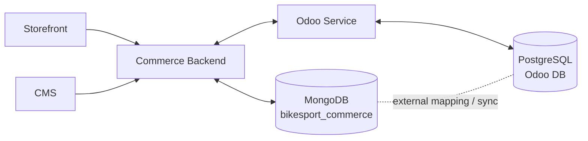

# BikeSport Database Documentation

Thư mục này là **nguồn chuẩn cho schema dữ liệu**. MongoDB và PostgreSQL/Odoo là hai kho dữ liệu tách biệt, **không dùng chung physical table/collection**.

## Cấu trúc

- `mongodb-schema.md`: toàn bộ collection của Commerce/CMS MongoDB.
- `odoo-postgresql-schema.md`: toàn bộ model/table PostgreSQL do Odoo quản lý.
- `cross-system-mapping.md`: mapping identifier và data flow giữa hai database.

## Quy tắc cho agent

1. Agent làm Commerce/CMS chỉ dùng schema trong `mongodb-schema.md`.
2. Agent làm Odoo chỉ dùng model/table trong `odoo-postgresql-schema.md`.
3. Không join trực tiếp MongoDB với PostgreSQL.
4. Dữ liệu đi qua API/event/sync contract và identifier mapping trong `cross-system-mapping.md`.
5. Không tạo collection/table/field mới nếu chưa có task `DATA-CHG-xxx` và cập nhật tài liệu schema tương ứng trước.
6. Một entity xuất hiện ở cả hai database không có nghĩa là cùng một record vật lý. Đó là hai representation được liên kết bằng identifier mapping.

## Không có phần nào "dùng chung database"

Các domain như Product, Order, Price, Inventory có thể xuất hiện ở cả hai bên, nhưng ownership khác nhau:

| Domain | MongoDB | PostgreSQL/Odoo |
| --- | --- | --- |
| Product | web presentation, attributes, SEO, media | ERP product/variant master theo decision |
| Inventory | read model phục vụ website | stock transaction/source |
| Price | read model/presentation | source theo pricing decision |
| Order | Commerce representation | back-office order lifecycle |
| Warranty | reference/presentation nếu cần | nghiệp vụ warranty |
| Store | display/enrichment | operational store/warehouse mapping |

Cross-system chỉ dùng mapping và synchronization; không có table/collection vật lý dùng chung.