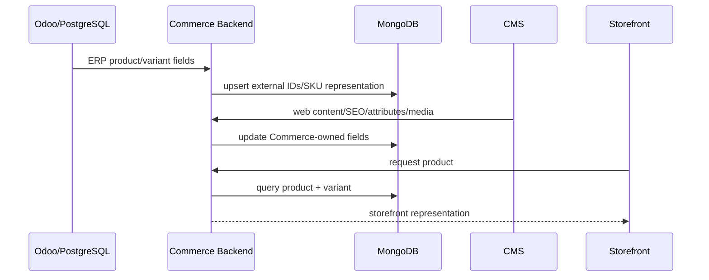
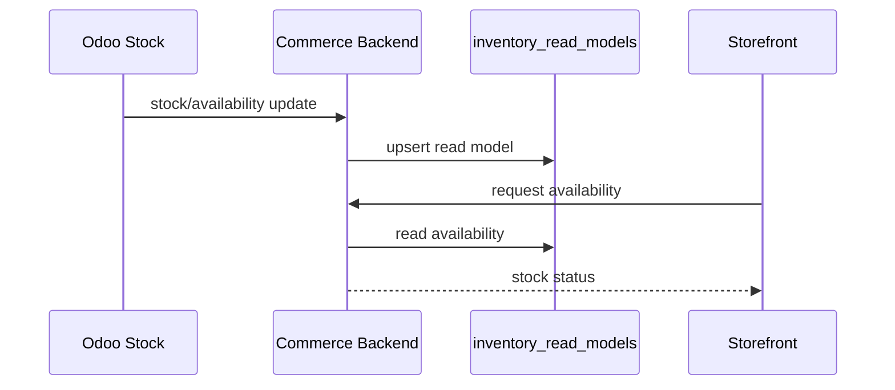
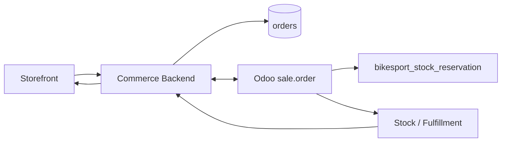

# Cross-system Data Mapping - MongoDB ↔ Odoo/PostgreSQL

**Mục tiêu:** chỉ mô tả phần dữ liệu đi qua ranh giới hai hệ thống. File này không định nghĩa collection/table mới.

## Nguyên tắc

- MongoDB và PostgreSQL không share physical table/collection.
- Không join chéo DB trực tiếp từ application logic.
- Mapping dùng identifier ổn định; không dùng display name.
- Transaction source và read model phải phân biệt rõ.
- Nếu ownership chưa chốt, write-path bị block nhưng schema vẫn giữ theo baseline.

## Entity mapping

| Business entity | MongoDB | Odoo/PostgreSQL | Mapping key | Direction hiện tại |
| --- | --- | --- | --- | --- |
| Product | `products.external_product_id` | `product.template` / `product_template.id` | external product ID | Odoo ↔ Commerce, ownership chờ DEC-001 |
| Variant | `product_variants.external_variant_id`, `sku` | `product.product` / `product_product.id` | external variant ID + SKU | Odoo → Commerce cho ERP fields |
| Inventory | `inventory_read_models` | `stock.quant`, `stock.move`, `stock.move.line` | variant + warehouse | Odoo → Commerce |
| Store | `external_mappings`/display data | `bikesport.store` | Odoo ID / stable store key | Odoo → Commerce, CMS enrich phần web |
| Warehouse | `inventory_read_models.warehouse_key` | `stock.warehouse` | warehouse key | Odoo → Commerce |
| Pricelist | `price_read_models.external_pricelist_id` | `product.pricelist` | pricelist ID | theo DEC-002 |
| Promotion | `promotion_presentations.external_promotion_id` | `bikesport.promotion.rule` nếu Odoo owner | promotion ID/code | theo DEC-003 |
| Order | `orders.external_order_id` | `sale.order` | order ID | hai chiều theo DEC-004 |
| Warranty | `external_mappings` nếu cần hiển thị | `bikesport.warranty.case` | warranty ID | Odoo → Commerce/API |
| Site/Channel | `sites.code` | `bikesport.channel.external_site_key` | stable site key | mapping config |

## Data ownership theo nhóm field

| Data group | MongoDB | Odoo/PostgreSQL |
| --- | --- | --- |
| Product web content | Write | Reference/No write |
| Flexible attributes | Write | Optional ERP subset |
| Media/SEO | Write | No |
| SKU/ERP fields | Read/reference | Write nếu DEC-001 xác nhận |
| Stock movement/balance | Read model only | Transaction source |
| Reservation | Read/status only nếu cần | Transaction source |
| Price | Read model hoặc owner theo DEC-002 | owner theo DEC-002 |
| Promotion presentation | Write | business rule source theo DEC-003 |
| Cart | Write | No |
| Order | Commerce representation | Back-office lifecycle; SoR theo DEC-004 |
| Warranty | Presentation/reference | Write/manage |
| Store operational data | Read/enrich | Write/manage |
| Site-specific content | Write | Channel mapping only |

## Product flow



## Inventory flow



`inventory_read_models` không bao giờ được dùng để tạo stock movement ngược vào Odoo.

## Order flow



Chiều tạo chính thức và system-of-record phụ thuộc `DEC-004`; agent không được tự chọn.

## Mapping registry

MongoDB collection `external_mappings` là registry chuẩn khi cần lưu mapping record-level:

```text
entity_type
commerce_id
odoo_model
odoo_id
external_key
created_at
updated_at
```

Không tạo collection mapping thứ hai như `odoo_mappings`, `erp_links`, `integration_ids`.

## Change rule

Thay đổi mapping key, sync direction, entity ownership hoặc payload phải:

1. cập nhật `decision-log.md` nếu là decision;
2. cập nhật schema file tương ứng nếu field thay đổi;
3. cập nhật integration spec;
4. cập nhật task/test/traceability liên quan.