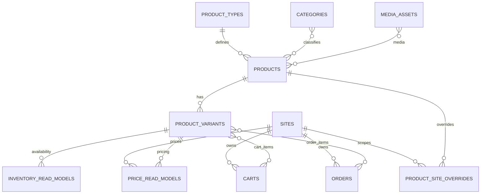

# Commerce MongoDB Schema - `bikesport_commerce`

**Status:** Canonical Draft  
**Owner:** Commerce Backend / CMS  
**Rule:** tên collection, field, type và index dưới đây là baseline bắt buộc. Không được tự tạo schema khác trong task feature.

## ERD

## Collection registry

| Collection | Vai trò | Writer chính |
| --- | --- | --- |
| `sites` | website/channel | Commerce admin |
| `product_types` | schema thuộc tính linh hoạt | CMS/Commerce |
| `categories` | taxonomy | CMS/Commerce |
| `products` | product presentation | CMS/Commerce |
| `product_variants` | Commerce SKU representation | integration/Commerce |
| `media_assets` | media registry | CMS |
| `product_site_overrides` | override theo site | CMS |
| `inventory_read_models` | stock availability read model | sync từ Odoo |
| `price_read_models` | price read model | sync/calculation theo decision |
| `promotion_presentations` | nội dung hiển thị promotion | CMS/Commerce |
| `carts` | cart transaction | Commerce Backend |
| `orders` | Commerce order representation | Commerce Backend/integration |
| `external_mappings` | ID mapping Odoo ↔ Commerce | integration |
| `sync_checkpoints` | sync cursor/status | integration |
| `sync_failures` | sync error queue/log | integration |

---

## `sites`

| Field | Type | Req | Constraint/Ghi chú |
| --- | --- | --- | --- |
| `_id` | ObjectId | Y | PK |
| `code` | string | Y | unique |
| `name` | string | Y | |
| `domain` | string | Y | unique |
| `default_locale` | string | Y | |
| `default_currency` | string | Y | ISO code |
| `status` | enum | Y | `active`,`inactive` |
| `created_at` | datetime | Y | UTC |
| `updated_at` | datetime | Y | UTC |

Indexes: unique `code`; unique `domain`; `status`.

## `product_types`

| Field | Type | Req | Constraint/Ghi chú |
| --- | --- | --- | --- |
| `_id` | ObjectId | Y | PK |
| `code` | string | Y | unique |
| `name` | string | Y | |
| `attribute_definitions` | array<object> | Y | registry thuộc tính |
| `attribute_definitions[].key` | string | Y | unique trong type |
| `attribute_definitions[].label` | string | Y | |
| `attribute_definitions[].data_type` | enum | Y | `string`,`number`,`boolean`,`enum`,`multi_enum` |
| `attribute_definitions[].unit` | string/null | N | |
| `attribute_definitions[].required` | boolean | Y | |
| `attribute_definitions[].filterable` | boolean | Y | |
| `attribute_definitions[].searchable` | boolean | Y | |
| `attribute_definitions[].sortable` | boolean | Y | |
| `attribute_definitions[].allowed_values` | array<string> | N | enum values |
| `attribute_definitions[].sort_order` | integer | Y | |
| `status` | enum | Y | `active`,`inactive` |
| `created_at` | datetime | Y | |
| `updated_at` | datetime | Y | |

Rule: `products.attributes` chỉ được dùng key có trong `attribute_definitions`.

## `categories`

| Field | Type | Req | Constraint/Ghi chú |
| --- | --- | --- | --- |
| `_id` | ObjectId | Y | PK |
| `parent_id` | ObjectId/null | N | self ref |
| `code` | string | Y | unique |
| `slug` | string | Y | unique |
| `name` | string | Y | |
| `path` | string | Y | materialized path |
| `sort_order` | integer | Y | default 0 |
| `status` | enum | Y | `active`,`inactive` |
| `created_at` | datetime | Y | |
| `updated_at` | datetime | Y | |

Indexes: `parent_id+sort_order`, `path`.

## `products`

| Field | Type | Req | Constraint/Ghi chú |
| --- | --- | --- | --- |
| `_id` | ObjectId | Y | PK |
| `external_product_id` | string/null | N | Odoo product.template mapping |
| `product_type_id` | ObjectId | Y | -> `product_types` |
| `code` | string | Y | unique |
| `slug` | string | Y | unique |
| `name` | string | Y | web name |
| `short_description` | string/null | N | |
| `description` | string/null | N | rich text format TBD |
| `category_ids` | array<ObjectId> | Y | -> `categories` |
| `attributes` | object | Y | keys từ `product_types` |
| `media_ids` | array<ObjectId> | Y | -> `media_assets` |
| `status` | enum | Y | `draft`,`published`,`archived` |
| `version` | integer | Y | bắt đầu 1 |
| `created_at` | datetime | Y | |
| `updated_at` | datetime | Y | |

Indexes: unique `code`; unique `slug`; `product_type_id`; `category_ids+status`; `status+updated_at`; sparse `external_product_id`.

**Không được thêm root field sản phẩm tùy ý.** `wheel_size`, `frame_material`, `groupset`... nằm trong `attributes`.

## `product_variants`

| Field | Type | Req | Constraint/Ghi chú |
| --- | --- | --- | --- |
| `_id` | ObjectId | Y | PK |
| `product_id` | ObjectId | Y | -> `products` |
| `external_variant_id` | string/null | N | Odoo product.product ID |
| `sku` | string | Y | unique |
| `barcode` | string/null | N | sparse unique |
| `option_values` | object | Y | size/color... |
| `status` | enum | Y | `active`,`inactive` |
| `created_at` | datetime | Y | |
| `updated_at` | datetime | Y | |

Indexes: unique `sku`; sparse unique `barcode`; sparse `external_variant_id`; `product_id+status`.

## `media_assets`

| Field | Type | Req | Constraint/Ghi chú |
| --- | --- | --- | --- |
| `_id` | ObjectId | Y | PK |
| `asset_key` | string | Y | unique |
| `type` | enum | Y | `image`,`video`,`document` |
| `url` | string | Y | |
| `alt_text` | string/null | N | |
| `width` | integer/null | N | |
| `height` | integer/null | N | |
| `mime_type` | string | Y | |
| `size_bytes` | integer | Y | |
| `status` | enum | Y | `active`,`deleted` |
| `created_at` | datetime | Y | |
| `updated_at` | datetime | Y | |

Indexes: unique `asset_key`; `type+status`.

## `product_site_overrides`

| Field | Type | Req | Constraint/Ghi chú |
| --- | --- | --- | --- |
| `_id` | ObjectId | Y | PK |
| `site_id` | ObjectId | Y | -> `sites` |
| `product_id` | ObjectId | Y | -> `products` |
| `visible` | boolean | Y | |
| `slug` | string/null | N | site override |
| `name` | string/null | N | site override |
| `short_description` | string/null | N | |
| `description` | string/null | N | |
| `seo_title` | string/null | N | |
| `seo_description` | string/null | N | |
| `media_ids` | array<ObjectId>/null | N | |
| `created_at` | datetime | Y | |
| `updated_at` | datetime | Y | |

Indexes: unique `site_id+product_id`; sparse unique `site_id+slug`; `site_id+visible`.

## `inventory_read_models`

| Field | Type | Req | Constraint/Ghi chú |
| --- | --- | --- | --- |
| `_id` | ObjectId | Y | PK |
| `variant_id` | ObjectId | Y | -> `product_variants` |
| `external_variant_id` | string | Y | Odoo variant key |
| `store_key` | string/null | N | mapping key |
| `warehouse_key` | string | Y | mapping key |
| `on_hand_qty` | decimal | Y | read model |
| `reserved_qty` | decimal | Y | read model |
| `available_qty` | decimal | Y | read model |
| `stock_status` | enum | Y | `in_stock`,`low_stock`,`out_of_stock` |
| `source_version` | string/null | N | |
| `source_updated_at` | datetime/null | N | |
| `synced_at` | datetime | Y | |

Indexes: unique `variant_id+warehouse_key`; `store_key+stock_status`; `external_variant_id`; `synced_at`.

**Không được ghi stock transaction vào collection này.**

## `price_read_models`

| Field | Type | Req | Constraint/Ghi chú |
| --- | --- | --- | --- |
| `_id` | ObjectId | Y | PK |
| `site_id` | ObjectId | Y | -> `sites` |
| `variant_id` | ObjectId | Y | -> `product_variants` |
| `external_pricelist_id` | string/null | N | |
| `currency` | string | Y | ISO |
| `list_price` | decimal | Y | |
| `sale_price` | decimal | Y | |
| `discount_amount` | decimal | Y | default 0 |
| `promotion_ids` | array<string> | Y | |
| `valid_from` | datetime/null | N | |
| `valid_to` | datetime/null | N | |
| `source_version` | string/null | N | |
| `synced_at` | datetime | Y | |

Indexes: unique `site_id+variant_id`; `site_id+sale_price`; `promotion_ids`; `synced_at`.

## `promotion_presentations`

| Field | Type | Req | Constraint/Ghi chú |
| --- | --- | --- | --- |
| `_id` | ObjectId | Y | PK |
| `external_promotion_id` | string/null | N | |
| `code` | string | Y | unique |
| `name` | string | Y | |
| `label` | string/null | N | storefront badge |
| `description` | string/null | N | |
| `site_ids` | array<ObjectId> | Y | |
| `priority` | integer | Y | default 0 |
| `valid_from` | datetime/null | N | |
| `valid_to` | datetime/null | N | |
| `status` | enum | Y | `draft`,`active`,`expired`,`disabled` |
| `created_at` | datetime | Y | |
| `updated_at` | datetime | Y | |

Indexes: unique `code`; sparse `external_promotion_id`; `site_ids+status+priority`.

## `carts`

| Field | Type | Req | Constraint/Ghi chú |
| --- | --- | --- | --- |
| `_id` | ObjectId | Y | PK |
| `site_id` | ObjectId | Y | -> `sites` |
| `customer_key` | string/null | N | |
| `session_key` | string | Y | unique |
| `items` | array<object> | Y | |
| `items[].variant_id` | ObjectId | Y | |
| `items[].sku` | string | Y | snapshot |
| `items[].quantity` | decimal | Y | > 0 |
| `items[].unit_price_snapshot` | decimal | Y | |
| `items[].promotion_ids` | array<string> | Y | |
| `currency` | string | Y | |
| `subtotal` | decimal | Y | |
| `discount_total` | decimal | Y | |
| `grand_total` | decimal | Y | |
| `expires_at` | datetime | Y | TTL |
| `created_at` | datetime | Y | |
| `updated_at` | datetime | Y | |

Indexes: unique `session_key`; `customer_key+updated_at`; TTL `expires_at`.

## `orders`

| Field | Type | Req | Constraint/Ghi chú |
| --- | --- | --- | --- |
| `_id` | ObjectId | Y | PK |
| `order_number` | string | Y | unique |
| `site_id` | ObjectId | Y | -> `sites` |
| `external_order_id` | string/null | N | Odoo sale.order ID |
| `customer_key` | string/null | N | |
| `customer_snapshot` | object | Y | immutable snapshot |
| `shipping_address` | object | Y | snapshot |
| `billing_address` | object/null | N | snapshot |
| `items` | array<object> | Y | |
| `items[].line_key` | string | Y | |
| `items[].variant_id` | ObjectId | Y | |
| `items[].sku` | string | Y | snapshot |
| `items[].name` | string | Y | snapshot |
| `items[].quantity` | decimal | Y | |
| `items[].unit_price` | decimal | Y | |
| `items[].discount_amount` | decimal | Y | |
| `items[].line_total` | decimal | Y | |
| `currency` | string | Y | |
| `subtotal` | decimal | Y | |
| `discount_total` | decimal | Y | |
| `shipping_total` | decimal | Y | |
| `grand_total` | decimal | Y | |
| `status` | enum | Y | `pending`,`confirmed`,`processing`,`completed`,`cancelled` |
| `integration_status` | enum | Y | `pending`,`synced`,`failed` |
| `integration_error_code` | string/null | N | |
| `created_at` | datetime | Y | |
| `updated_at` | datetime | Y | |

Indexes: unique `order_number`; sparse unique `external_order_id`; `customer_key+created_at`; `site_id+status+created_at`; `integration_status+updated_at`.

## `external_mappings`

| Field | Type | Req | Constraint/Ghi chú |
| --- | --- | --- | --- |
| `_id` | ObjectId | Y | PK |
| `entity_type` | enum | Y | `product`,`variant`,`store`,`warehouse`,`order`,`warranty`,`promotion`,`pricelist` |
| `commerce_id` | string | Y | |
| `odoo_model` | string | Y | |
| `odoo_id` | integer | Y | |
| `external_key` | string/null | N | stable business key |
| `created_at` | datetime | Y | |
| `updated_at` | datetime | Y | |

Indexes: unique `entity_type+commerce_id`; unique `odoo_model+odoo_id`; sparse `entity_type+external_key`.

## `sync_checkpoints`

| Field | Type | Req | Constraint/Ghi chú |
| --- | --- | --- | --- |
| `_id` | ObjectId | Y | PK |
| `domain` | enum | Y | `product`,`inventory`,`price`,`promotion`,`order`,`store`,`warranty` |
| `direction` | enum | Y | `odoo_to_commerce`,`commerce_to_odoo` |
| `cursor` | string/null | N | |
| `last_success_at` | datetime/null | N | |
| `last_run_at` | datetime/null | N | |
| `status` | enum | Y | `idle`,`running`,`failed` |
| `updated_at` | datetime | Y | |

Index: unique `domain+direction`.

## `sync_failures`

| Field | Type | Req | Constraint/Ghi chú |
| --- | --- | --- | --- |
| `_id` | ObjectId | Y | PK |
| `domain` | enum | Y | sync domain |
| `direction` | enum | Y | sync direction |
| `source_key` | string | Y | |
| `target_key` | string/null | N | |
| `payload_hash` | string/null | N | |
| `error_code` | string | Y | stable code |
| `error_message` | string | Y | |
| `attempt_count` | integer | Y | >= 1 |
| `status` | enum | Y | `open`,`retrying`,`resolved`,`ignored` |
| `first_failed_at` | datetime | Y | |
| `last_failed_at` | datetime | Y | |
| `resolved_at` | datetime/null | N | |

Indexes: `domain+status+last_failed_at`; `source_key+status`.

## Schema-change rule

Nếu task cần field/collection khác: tạo `DATA-CHG-xxx`, sửa file này trước, mô tả migration/backfill/index/API impact rồi mới code.