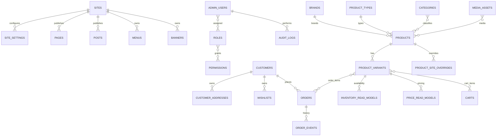

# Commerce MongoDB Schema Registry - `bikesport_commerce`

**Status:** Canonical Draft  
**Owner:** Commerce Backend / CMS  
**Mục tiêu:** đây là registry bắt buộc của toàn bộ MongoDB schema. Agent không được tự tạo collection mới ngoài registry này.

## 1. Schema được tách theo domain

| Domain | File | Collections |
| --- | --- | --- |
| Identity & Access | `mongodb/identity-access.md` | `admin_users`, `roles`, `permissions`, `admin_sessions`, `audit_logs` |
| Customer | `mongodb/customer.md` | `customers`, `customer_addresses`, `wishlists` |
| CMS / Content | `mongodb/content-cms.md` | `sites`, `pages`, `posts`, `post_categories`, `tags`, `menus`, `banners`, `redirects`, `site_settings` |
| Catalog | `mongodb/catalog.md` | `brands`, `product_types`, `categories`, `products`, `product_variants`, `media_assets`, `product_site_overrides`, `product_collections` |
| Commerce | `mongodb/commerce.md` | `promotion_presentations`, `carts`, `orders`, `order_events`, `shipping_methods`, `payment_methods` |
| Operational Read Models & Integration | `mongodb/integration-read-models.md` | `inventory_read_models`, `price_read_models`, `store_read_models`, `warranty_read_models`, `external_mappings`, `sync_checkpoints`, `sync_failures` |

Tổng baseline hiện tại: **39 collections**.

## 2. Quy tắc không được phá

1. Mỗi collection chỉ có một file canonical.
2. Không được tạo collection khác tên nhưng cùng mục đích, ví dụ `users`, `cms_users`, `staff_users` song song với `admin_users`.
3. Không được tạo `product_images`; dùng `media_assets` + `products.media_ids`/`product_site_overrides.media_ids`.
4. Không được tạo `settings_*` tùy feature; dùng `site_settings` theo `namespace + key`, trừ khi schema change được phê duyệt.
5. Không được tạo `stocks`/`inventories`; Commerce chỉ dùng `inventory_read_models`. Stock transaction thuộc Odoo.
6. Customer và Admin User là hai bounded context khác nhau: `customers` không được dùng thay cho `admin_users`.
7. Page và Post là hai content type riêng; không nhét blog post vào `pages` hoặc ngược lại.
8. Mọi field/index/relation phải theo file domain tương ứng.
9. Nếu thiếu collection/field thật sự: tạo `DATA-CHG-xxx`, cập nhật schema + migration + task/test trước khi code.

## 3. Quan hệ tổng quan

## 4. Agent lookup

- `CMS-*` -> đọc `identity-access.md`, `content-cms.md`, `catalog.md` theo task.
- `BE-*` -> đọc collection domain tương ứng + integration read models.
- `SF-*` -> chỉ consume API; không đổi MongoDB schema trực tiếp.
- `ODOO-*` -> không dùng file MongoDB này, đọc `odoo-postgresql-schema.md`.
- `INT-*` -> đọc cả schema MongoDB liên quan + `odoo-postgresql-schema.md` + `cross-system-mapping.md`.
