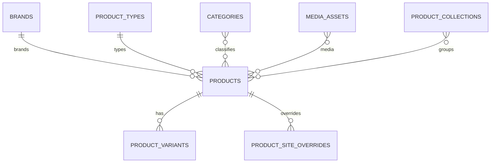

# MongoDB - Catalog Schema

**Status:** Canonical Draft  
**Scope:** product catalog và merchandising data của Commerce/CMS.

## `brands`

| Field | Type | Req | Ghi chú |
| --- | --- | --- | --- |
| `_id` | ObjectId | Y | PK |
| `code` | string | Y | unique |
| `slug` | string | Y | unique |
| `name` | string | Y | |
| `logo_media_id` | ObjectId/null | N | -> `media_assets` |
| `description` | string/null | N | |
| `website_url` | string/null | N | |
| `status` | enum | Y | `active`,`inactive` |
| `created_at` | datetime | Y | |
| `updated_at` | datetime | Y | |

Indexes: unique `code`; unique `slug`; `status`.

## `product_types`

| Field | Type | Req | Ghi chú |
| --- | --- | --- | --- |
| `_id` | ObjectId | Y | PK |
| `code` | string | Y | unique |
| `name` | string | Y | |
| `attribute_definitions` | array<object> | Y | registry thuộc tính |
| `attribute_definitions[].key` | string | Y | unique trong type |
| `attribute_definitions[].label` | string | Y | |
| `attribute_definitions[].data_type` | enum | Y | `string`,`number`,`boolean`,`enum`,`multi_enum`,`date` |
| `attribute_definitions[].unit` | string/null | N | |
| `attribute_definitions[].required` | boolean | Y | |
| `attribute_definitions[].filterable` | boolean | Y | |
| `attribute_definitions[].searchable` | boolean | Y | |
| `attribute_definitions[].sortable` | boolean | Y | |
| `attribute_definitions[].allowed_values` | array<string> | N | |
| `attribute_definitions[].sort_order` | integer | Y | |
| `status` | enum | Y | `active`,`inactive` |
| `created_at` | datetime | Y | |
| `updated_at` | datetime | Y | |

Indexes: unique `code`; `status`.

## `categories`

| Field | Type | Req | Ghi chú |
| --- | --- | --- | --- |
| `_id` | ObjectId | Y | PK |
| `parent_id` | ObjectId/null | N | self ref |
| `code` | string | Y | unique |
| `slug` | string | Y | default slug |
| `name` | string | Y | |
| `description` | string/null | N | |
| `media_id` | ObjectId/null | N | -> `media_assets` |
| `path` | string | Y | materialized path |
| `sort_order` | integer | Y | default 0 |
| `status` | enum | Y | `active`,`inactive` |
| `created_at` | datetime | Y | |
| `updated_at` | datetime | Y | |

Indexes: unique `code`; unique `slug`; `parent_id+sort_order`; `path`; `status`.

## `products`

| Field | Type | Req | Ghi chú |
| --- | --- | --- | --- |
| `_id` | ObjectId | Y | PK |
| `external_product_id` | string/null | N | Odoo template mapping |
| `product_type_id` | ObjectId | Y | -> `product_types` |
| `brand_id` | ObjectId/null | N | -> `brands` |
| `code` | string | Y | unique Commerce code |
| `slug` | string | Y | default slug |
| `name` | string | Y | web name |
| `short_description` | string/null | N | |
| `description` | string/null | N | |
| `category_ids` | array<ObjectId> | Y | -> `categories` |
| `attributes` | object | Y | keys phải tồn tại trong product type |
| `media_ids` | array<ObjectId> | Y | -> `media_assets` |
| `featured_media_id` | ObjectId/null | N | -> `media_assets` |
| `search_keywords` | array<string> | Y | normalized terms |
| `status` | enum | Y | `draft`,`published`,`archived` |
| `version` | integer | Y | optimistic version |
| `created_at` | datetime | Y | |
| `updated_at` | datetime | Y | |

Indexes: unique `code`; unique `slug`; `product_type_id`; `brand_id`; `category_ids+status`; `status+updated_at`; sparse `external_product_id`; text/search index tùy search implementation.

## `product_variants`

| Field | Type | Req | Ghi chú |
| --- | --- | --- | --- |
| `_id` | ObjectId | Y | PK |
| `product_id` | ObjectId | Y | -> `products` |
| `external_variant_id` | string/null | N | Odoo product.product mapping |
| `sku` | string | Y | unique |
| `barcode` | string/null | N | sparse unique |
| `option_values` | object | Y | size/color/... |
| `media_ids` | array<ObjectId> | Y | variant-specific media nếu có |
| `status` | enum | Y | `active`,`inactive` |
| `created_at` | datetime | Y | |
| `updated_at` | datetime | Y | |

Indexes: unique `sku`; sparse unique `barcode`; sparse `external_variant_id`; `product_id+status`.

## `media_assets`

| Field | Type | Req | Ghi chú |
| --- | --- | --- | --- |
| `_id` | ObjectId | Y | PK |
| `asset_key` | string | Y | unique storage key |
| `type` | enum | Y | `image`,`video`,`document` |
| `url` | string | Y | |
| `alt_text` | string/null | N | |
| `title` | string/null | N | |
| `width` | integer/null | N | |
| `height` | integer/null | N | |
| `mime_type` | string | Y | |
| `size_bytes` | integer | Y | |
| `metadata` | object | Y | sanitized metadata |
| `status` | enum | Y | `active`,`deleted` |
| `uploaded_by` | ObjectId/null | N | -> `admin_users` |
| `created_at` | datetime | Y | |
| `updated_at` | datetime | Y | |

Indexes: unique `asset_key`; `type+status`; `uploaded_by+created_at`.

## `product_site_overrides`

| Field | Type | Req | Ghi chú |
| --- | --- | --- | --- |
| `_id` | ObjectId | Y | PK |
| `site_id` | ObjectId | Y | -> `sites` |
| `product_id` | ObjectId | Y | -> `products` |
| `visible` | boolean | Y | |
| `slug` | string/null | N | override |
| `name` | string/null | N | override |
| `short_description` | string/null | N | override |
| `description` | string/null | N | override |
| `seo` | object/null | N | title/description/canonical/robots/og |
| `media_ids` | array<ObjectId>/null | N | override |
| `sort_weight` | integer | Y | default 0 |
| `created_at` | datetime | Y | |
| `updated_at` | datetime | Y | |

Indexes: unique `site_id+product_id`; sparse unique `site_id+slug`; `site_id+visible+sort_weight`.

## `product_collections`

Merchandising group như featured/new arrivals/campaign collection, không thay category taxonomy.

| Field | Type | Req | Ghi chú |
| --- | --- | --- | --- |
| `_id` | ObjectId | Y | PK |
| `site_id` | ObjectId | Y | -> `sites` |
| `code` | string | Y | unique trong site |
| `name` | string | Y | |
| `slug` | string | Y | unique trong site |
| `description` | string/null | N | |
| `product_ids` | array<ObjectId> | Y | explicit collection membership |
| `sort_mode` | enum | Y | `manual`,`newest`,`price_asc`,`price_desc` |
| `status` | enum | Y | `draft`,`active`,`inactive` |
| `created_at` | datetime | Y | |
| `updated_at` | datetime | Y | |

Indexes: unique `site_id+code`; unique `site_id+slug`; `site_id+status`; `product_ids`.

## Rules

- Không thêm product attribute ở root `products`; dùng `attributes` + `product_types.attribute_definitions`.
- Category và Collection khác nhau: category = taxonomy, collection = merchandising.
- Product media dùng `media_assets`; không tạo collection `product_images` riêng.
