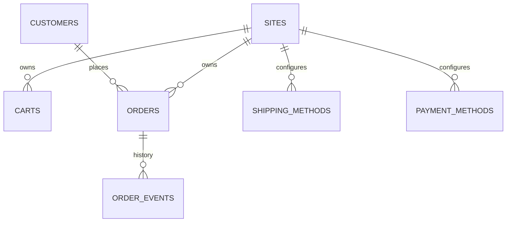

# MongoDB - Commerce Transaction Schema

**Status:** Canonical Draft  
**Scope:** promotion presentation, cart, order, order history và checkout configuration.

## `promotion_presentations`

| Field | Type | Req | Ghi chú |
| --- | --- | --- | --- |
| `_id` | ObjectId | Y | PK |
| `external_promotion_id` | string/null | N | mapping promotion rule nguồn |
| `code` | string | Y | unique |
| `name` | string | Y | |
| `label` | string/null | N | storefront badge |
| `description` | string/null | N | |
| `site_ids` | array<ObjectId> | Y | -> `sites` |
| `media_id` | ObjectId/null | N | -> `media_assets` |
| `priority` | integer | Y | default 0 |
| `valid_from` | datetime/null | N | |
| `valid_to` | datetime/null | N | |
| `status` | enum | Y | `draft`,`active`,`expired`,`disabled` |
| `created_at` | datetime | Y | |
| `updated_at` | datetime | Y | |

Indexes: unique `code`; sparse `external_promotion_id`; `site_ids+status+priority`; `valid_from+valid_to`.

## `carts`

| Field | Type | Req | Ghi chú |
| --- | --- | --- | --- |
| `_id` | ObjectId | Y | PK |
| `site_id` | ObjectId | Y | -> `sites` |
| `customer_id` | ObjectId/null | N | -> `customers` |
| `session_key` | string | Y | unique |
| `items` | array<object> | Y | |
| `items[].variant_id` | ObjectId | Y | -> `product_variants` |
| `items[].sku` | string | Y | snapshot |
| `items[].quantity` | decimal | Y | > 0 |
| `items[].unit_price_snapshot` | decimal | Y | |
| `items[].promotion_ids` | array<string> | Y | |
| `currency` | string | Y | ISO |
| `subtotal` | decimal | Y | snapshot |
| `discount_total` | decimal | Y | snapshot |
| `shipping_total` | decimal | Y | snapshot, default 0 |
| `grand_total` | decimal | Y | snapshot |
| `shipping_method_code` | string/null | N | |
| `payment_method_code` | string/null | N | |
| `expires_at` | datetime | Y | TTL |
| `created_at` | datetime | Y | |
| `updated_at` | datetime | Y | |

Indexes: unique `session_key`; `customer_id+updated_at`; `site_id+updated_at`; TTL `expires_at`.

## `orders`

| Field | Type | Req | Ghi chú |
| --- | --- | --- | --- |
| `_id` | ObjectId | Y | PK |
| `order_number` | string | Y | unique |
| `site_id` | ObjectId | Y | -> `sites` |
| `external_order_id` | string/null | N | Odoo sale.order mapping |
| `customer_id` | ObjectId/null | N | -> `customers`; guest allowed |
| `customer_snapshot` | object | Y | name/email/phone snapshot |
| `shipping_address` | object | Y | immutable snapshot |
| `billing_address` | object/null | N | immutable snapshot |
| `items` | array<object> | Y | |
| `items[].line_key` | string | Y | unique within order |
| `items[].product_id` | ObjectId | Y | snapshot reference |
| `items[].variant_id` | ObjectId | Y | |
| `items[].sku` | string | Y | snapshot |
| `items[].name` | string | Y | snapshot |
| `items[].quantity` | decimal | Y | |
| `items[].unit_price` | decimal | Y | |
| `items[].discount_amount` | decimal | Y | |
| `items[].line_total` | decimal | Y | |
| `items[].promotion_ids` | array<string> | Y | |
| `currency` | string | Y | |
| `subtotal` | decimal | Y | |
| `discount_total` | decimal | Y | |
| `shipping_total` | decimal | Y | |
| `grand_total` | decimal | Y | |
| `shipping_method_code` | string | Y | snapshot code |
| `payment_method_code` | string | Y | snapshot code |
| `payment_status` | enum | Y | `pending`,`authorized`,`paid`,`failed`,`refunded`,`cancelled` |
| `fulfillment_status` | enum | Y | `unfulfilled`,`reserved`,`processing`,`shipped`,`completed`,`cancelled` |
| `status` | enum | Y | `pending`,`confirmed`,`processing`,`completed`,`cancelled` |
| `integration_status` | enum | Y | `pending`,`synced`,`failed` |
| `integration_error_code` | string/null | N | |
| `placed_at` | datetime | Y | |
| `created_at` | datetime | Y | |
| `updated_at` | datetime | Y | |

Indexes: unique `order_number`; sparse unique `external_order_id`; `customer_id+created_at`; `site_id+status+created_at`; `payment_status`; `fulfillment_status`; `integration_status+updated_at`.

## `order_events`

Append-only event/history để audit state change phía Commerce.

| Field | Type | Req | Ghi chú |
| --- | --- | --- | --- |
| `_id` | ObjectId | Y | PK |
| `order_id` | ObjectId | Y | -> `orders` |
| `event_type` | string | Y | `created`,`confirmed`,`sync_failed`,`status_changed`... |
| `from_status` | string/null | N | |
| `to_status` | string/null | N | |
| `actor_type` | enum | Y | `customer`,`admin`,`system`,`odoo` |
| `actor_id` | string/null | N | |
| `payload` | object | Y | event metadata, không chứa secret |
| `created_at` | datetime | Y | immutable |

Indexes: `order_id+created_at`; `event_type+created_at`.

## `shipping_methods`

| Field | Type | Req | Ghi chú |
| --- | --- | --- | --- |
| `_id` | ObjectId | Y | PK |
| `site_id` | ObjectId | Y | -> `sites` |
| `code` | string | Y | unique trong site |
| `name` | string | Y | |
| `provider` | string | Y | internal/external provider key |
| `config` | object | Y | non-secret config; secret dùng ref |
| `sort_order` | integer | Y | |
| `status` | enum | Y | `active`,`inactive` |
| `created_at` | datetime | Y | |
| `updated_at` | datetime | Y | |

Indexes: unique `site_id+code`; `site_id+status+sort_order`.

## `payment_methods`

| Field | Type | Req | Ghi chú |
| --- | --- | --- | --- |
| `_id` | ObjectId | Y | PK |
| `site_id` | ObjectId | Y | -> `sites` |
| `code` | string | Y | unique trong site |
| `name` | string | Y | |
| `provider` | string | Y | `cod` hoặc payment provider key |
| `config` | object | Y | không chứa secret thô |
| `sort_order` | integer | Y | |
| `status` | enum | Y | `active`,`inactive` |
| `created_at` | datetime | Y | |
| `updated_at` | datetime | Y | |

Indexes: unique `site_id+code`; `site_id+status+sort_order`.

## Rules

- `orders` giữ snapshot dữ liệu cần thiết; không render order cũ bằng live product/customer data.
- `order_events` append-only, không dùng thay `orders` current state.
- Payment provider token/secret không lưu trực tiếp trong MongoDB config.
- Order ownership vẫn phụ thuộc `DEC-004`, nhưng collection shape là canonical Commerce representation.
