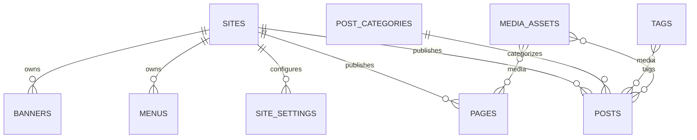

# MongoDB - CMS / Content Schema

**Status:** Canonical Draft  
**Scope:** website, page, post, taxonomy nội dung, menu, banner, redirect và setting theo site.

## `sites`

| Field | Type | Req | Ghi chú |
| --- | --- | --- | --- |
| `_id` | ObjectId | Y | PK |
| `code` | string | Y | unique stable site code |
| `name` | string | Y | |
| `domain` | string | Y | unique primary domain |
| `default_locale` | string | Y | |
| `supported_locales` | array<string> | Y | |
| `default_currency` | string | Y | ISO |
| `timezone` | string | Y | IANA timezone |
| `status` | enum | Y | `active`,`inactive`,`maintenance` |
| `created_at` | datetime | Y | |
| `updated_at` | datetime | Y | |

Indexes: unique `code`; unique `domain`; `status`.

## `pages`

| Field | Type | Req | Ghi chú |
| --- | --- | --- | --- |
| `_id` | ObjectId | Y | PK |
| `site_id` | ObjectId | Y | -> `sites` |
| `parent_id` | ObjectId/null | N | self ref nếu page hierarchy |
| `template_key` | string | Y | ví dụ `default`,`landing`,`contact` |
| `slug` | string | Y | unique trong site |
| `title` | string | Y | |
| `excerpt` | string/null | N | |
| `blocks` | array<object> | Y | structured content blocks |
| `seo` | object | Y | `title`,`description`,`canonical_url`,`robots`,`og_image_id` |
| `status` | enum | Y | `draft`,`review`,`published`,`archived` |
| `published_at` | datetime/null | N | |
| `author_id` | ObjectId | Y | -> `admin_users` |
| `last_editor_id` | ObjectId | Y | -> `admin_users` |
| `version` | integer | Y | optimistic/versioning |
| `created_at` | datetime | Y | |
| `updated_at` | datetime | Y | |

Indexes: unique `site_id+slug`; `site_id+status+published_at`; `parent_id`; `author_id`.

## `posts`

| Field | Type | Req | Ghi chú |
| --- | --- | --- | --- |
| `_id` | ObjectId | Y | PK |
| `site_id` | ObjectId | Y | -> `sites` |
| `slug` | string | Y | unique trong site |
| `title` | string | Y | |
| `excerpt` | string/null | N | |
| `content` | object | Y | rich/block content |
| `featured_media_id` | ObjectId/null | N | -> `media_assets` |
| `category_ids` | array<ObjectId> | Y | -> `post_categories` |
| `tag_ids` | array<ObjectId> | Y | -> `tags` |
| `author_id` | ObjectId | Y | -> `admin_users` |
| `seo` | object | Y | same contract as page |
| `status` | enum | Y | `draft`,`review`,`scheduled`,`published`,`archived` |
| `published_at` | datetime/null | N | |
| `scheduled_at` | datetime/null | N | |
| `version` | integer | Y | |
| `created_at` | datetime | Y | |
| `updated_at` | datetime | Y | |

Indexes: unique `site_id+slug`; `site_id+status+published_at`; `category_ids`; `tag_ids`; `author_id`.

## `post_categories`

| Field | Type | Req | Ghi chú |
| --- | --- | --- | --- |
| `_id` | ObjectId | Y | PK |
| `site_id` | ObjectId | Y | -> `sites` |
| `parent_id` | ObjectId/null | N | self ref |
| `slug` | string | Y | unique trong site |
| `name` | string | Y | |
| `description` | string/null | N | |
| `sort_order` | integer | Y | default 0 |
| `status` | enum | Y | `active`,`inactive` |
| `created_at` | datetime | Y | |
| `updated_at` | datetime | Y | |

Indexes: unique `site_id+slug`; `site_id+parent_id+sort_order`.

## `tags`

| Field | Type | Req | Ghi chú |
| --- | --- | --- | --- |
| `_id` | ObjectId | Y | PK |
| `site_id` | ObjectId | Y | -> `sites` |
| `slug` | string | Y | unique trong site |
| `name` | string | Y | |
| `created_at` | datetime | Y | |
| `updated_at` | datetime | Y | |

Indexes: unique `site_id+slug`; `site_id+name`.

## `menus`

Menu items embed trong document để giữ ordering/tree atomically.

| Field | Type | Req | Ghi chú |
| --- | --- | --- | --- |
| `_id` | ObjectId | Y | PK |
| `site_id` | ObjectId | Y | -> `sites` |
| `code` | string | Y | `header-main`,`footer-company`... |
| `name` | string | Y | |
| `items` | array<object> | Y | tree items |
| `items[].key` | string | Y | unique trong menu |
| `items[].parent_key` | string/null | N | tree relation |
| `items[].label` | string | Y | |
| `items[].type` | enum | Y | `page`,`post_category`,`product_category`,`url` |
| `items[].target_id` | string/null | N | entity id khi internal |
| `items[].url` | string/null | N | external/manual url |
| `items[].sort_order` | integer | Y | |
| `items[].visible` | boolean | Y | |
| `status` | enum | Y | `active`,`inactive` |
| `created_at` | datetime | Y | |
| `updated_at` | datetime | Y | |

Indexes: unique `site_id+code`; `site_id+status`.

## `banners`

| Field | Type | Req | Ghi chú |
| --- | --- | --- | --- |
| `_id` | ObjectId | Y | PK |
| `site_id` | ObjectId | Y | -> `sites` |
| `code` | string | Y | unique trong site |
| `placement` | string | Y | `home.hero`, `catalog.top`... |
| `title` | string/null | N | |
| `subtitle` | string/null | N | |
| `media_id` | ObjectId | Y | -> `media_assets` |
| `mobile_media_id` | ObjectId/null | N | |
| `link_type` | enum | Y | `none`,`internal`,`external` |
| `link_target` | string/null | N | |
| `sort_order` | integer | Y | |
| `valid_from` | datetime/null | N | |
| `valid_to` | datetime/null | N | |
| `status` | enum | Y | `draft`,`active`,`inactive` |
| `created_at` | datetime | Y | |
| `updated_at` | datetime | Y | |

Indexes: unique `site_id+code`; `site_id+placement+status+sort_order`; `valid_from+valid_to`.

## `redirects`

| Field | Type | Req | Ghi chú |
| --- | --- | --- | --- |
| `_id` | ObjectId | Y | PK |
| `site_id` | ObjectId | Y | -> `sites` |
| `source_path` | string | Y | unique trong site |
| `target_url` | string | Y | |
| `http_status` | enum | Y | `301`,`302`,`307`,`308` |
| `active` | boolean | Y | |
| `created_by` | ObjectId | Y | -> `admin_users` |
| `created_at` | datetime | Y | |
| `updated_at` | datetime | Y | |

Indexes: unique `site_id+source_path`; `site_id+active`.

## `site_settings`

Không tạo collection setting riêng theo feature. Settings được namespace rõ.

| Field | Type | Req | Ghi chú |
| --- | --- | --- | --- |
| `_id` | ObjectId | Y | PK |
| `site_id` | ObjectId | Y | -> `sites` |
| `namespace` | string | Y | `general`,`seo`,`catalog`,`checkout`,`contact`,`social`,`analytics`,`theme`... |
| `key` | string | Y | stable key |
| `value` | any-json | Y | phải validate theo registry/application contract |
| `value_type` | enum | Y | `string`,`number`,`boolean`,`object`,`array`,`secret_ref` |
| `is_public` | boolean | Y | có được expose Storefront hay không |
| `updated_by` | ObjectId | Y | -> `admin_users` |
| `created_at` | datetime | Y | |
| `updated_at` | datetime | Y | |

Indexes: unique `site_id+namespace+key`; `site_id+namespace`; `is_public`.

## Rules

- Page/Post publish phải qua permission `content.*.publish` nếu RBAC áp dụng.
- `site_settings.value` không được chứa secret thô; dùng `secret_ref` nếu cần secret.
- Slug unique theo site, không global giữa nhiều site.
- `pages.blocks`/`posts.content` phải dùng block registry ở code/schema validation; agent không được tạo block type tùy ý trong feature task.
