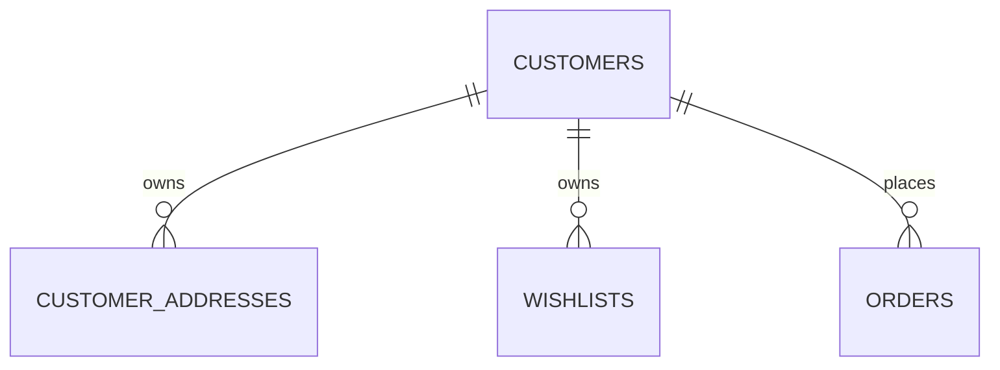

# MongoDB - Customer Schema

**Status:** Canonical Draft  
**Scope:** customer-facing identity/profile data của Commerce. Tách khỏi CMS `admin_users`.

## `customers`

| Field | Type | Req | Ghi chú |
| --- | --- | --- | --- |
| `_id` | ObjectId | Y | PK |
| `external_customer_id` | string/null | N | Odoo `res.partner` mapping nếu dùng |
| `email` | string/null | N | sparse unique nếu account dùng email |
| `phone` | string/null | N | normalized, sparse index |
| `password_hash` | string/null | N | chỉ khi local auth; không plaintext |
| `first_name` | string/null | N | |
| `last_name` | string/null | N | |
| `display_name` | string/null | N | |
| `date_of_birth` | date/null | N | chỉ nếu business cần |
| `gender` | enum/null | N | chỉ nếu scope xác nhận |
| `marketing_opt_in` | boolean | Y | default false |
| `status` | enum | Y | `guest`,`active`,`blocked`,`deleted` |
| `last_login_at` | datetime/null | N | |
| `created_at` | datetime | Y | |
| `updated_at` | datetime | Y | |

Indexes: sparse unique `email`; sparse `phone`; sparse `external_customer_id`; `status+created_at`.

## `customer_addresses`

| Field | Type | Req | Ghi chú |
| --- | --- | --- | --- |
| `_id` | ObjectId | Y | PK |
| `customer_id` | ObjectId | Y | -> `customers` |
| `label` | string/null | N | Home/Office... |
| `recipient_name` | string | Y | |
| `phone` | string | Y | |
| `line1` | string | Y | |
| `line2` | string/null | N | |
| `ward_code` | string/null | N | tùy address provider |
| `district_code` | string/null | N | |
| `province_code` | string/null | N | |
| `country_code` | string | Y | ISO-2 |
| `postal_code` | string/null | N | |
| `is_default_shipping` | boolean | Y | default false |
| `is_default_billing` | boolean | Y | default false |
| `created_at` | datetime | Y | |
| `updated_at` | datetime | Y | |

Indexes: `customer_id`; `customer_id+is_default_shipping`; `customer_id+is_default_billing`.

## `wishlists`

| Field | Type | Req | Ghi chú |
| --- | --- | --- | --- |
| `_id` | ObjectId | Y | PK |
| `customer_id` | ObjectId | Y | -> `customers` |
| `site_id` | ObjectId | Y | -> `sites` |
| `name` | string | Y | default `Default` |
| `items` | array<object> | Y | |
| `items[].product_id` | ObjectId | Y | -> `products` |
| `items[].variant_id` | ObjectId/null | N | -> `product_variants` |
| `items[].added_at` | datetime | Y | |
| `created_at` | datetime | Y | |
| `updated_at` | datetime | Y | |

Indexes: unique `customer_id+site_id+name`; `items.product_id`.

## Rules

- Guest checkout vẫn có thể tạo `orders.customer_snapshot` mà không bắt buộc có `customers` record.
- Order snapshot không được phụ thuộc live vào customer/address sau khi order đã tạo.
- Customer PII phải có retention/access rule riêng khi NFR/privacy được chốt.
