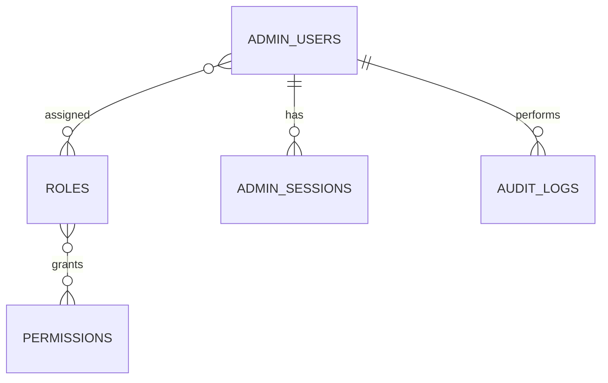

# MongoDB - Identity & Access Schema

**Status:** Canonical Draft  
**Scope:** CMS/admin identity, RBAC, session và audit. Không dùng cho customer account.

## ERD

## `admin_users`

| Field | Type | Req | Ghi chú |
| --- | --- | --- | --- |
| `_id` | ObjectId | Y | PK |
| `email` | string | Y | unique, normalized lowercase |
| `username` | string/null | N | sparse unique |
| `password_hash` | string/null | N | nếu dùng local auth; không lưu plaintext |
| `display_name` | string | Y | |
| `avatar_url` | string/null | N | |
| `role_ids` | array<ObjectId> | Y | -> `roles` |
| `site_ids` | array<ObjectId> | Y | site scope được phép thao tác; rỗng = chưa cấp |
| `status` | enum | Y | `invited`,`active`,`suspended`,`disabled` |
| `last_login_at` | datetime/null | N | |
| `created_by` | ObjectId/null | N | self ref admin user |
| `created_at` | datetime | Y | UTC |
| `updated_at` | datetime | Y | UTC |

Indexes: unique `email`; sparse unique `username`; `role_ids`; `site_ids+status`.

## `roles`

| Field | Type | Req | Ghi chú |
| --- | --- | --- | --- |
| `_id` | ObjectId | Y | PK |
| `code` | string | Y | unique, ví dụ `catalog_editor` |
| `name` | string | Y | |
| `description` | string/null | N | |
| `permission_ids` | array<ObjectId> | Y | -> `permissions` |
| `system_role` | boolean | Y | role hệ thống không xóa tùy ý |
| `status` | enum | Y | `active`,`inactive` |
| `created_at` | datetime | Y | |
| `updated_at` | datetime | Y | |

Indexes: unique `code`; `status`.

## `permissions`

| Field | Type | Req | Ghi chú |
| --- | --- | --- | --- |
| `_id` | ObjectId | Y | PK |
| `key` | string | Y | unique, dạng `catalog.product.read` |
| `domain` | string | Y | `catalog`,`content`,`order`,`settings`,`user`,`media`,`promotion`,`store`,`warranty`... |
| `action` | string | Y | `read`,`create`,`update`,`delete`,`publish`,`approve`,`retry`,`manage` |
| `description` | string | Y | |
| `created_at` | datetime | Y | |

Indexes: unique `key`; `domain+action`.

## `admin_sessions`

| Field | Type | Req | Ghi chú |
| --- | --- | --- | --- |
| `_id` | ObjectId | Y | PK |
| `user_id` | ObjectId | Y | -> `admin_users` |
| `session_key_hash` | string | Y | unique; chỉ lưu hash/token identifier an toàn |
| `ip_hash` | string/null | N | privacy-preserving nếu cần |
| `user_agent` | string/null | N | |
| `expires_at` | datetime | Y | TTL |
| `revoked_at` | datetime/null | N | |
| `created_at` | datetime | Y | |

Indexes: unique `session_key_hash`; `user_id+created_at`; TTL `expires_at`.

## `audit_logs`

| Field | Type | Req | Ghi chú |
| --- | --- | --- | --- |
| `_id` | ObjectId | Y | PK |
| `actor_user_id` | ObjectId/null | N | -> `admin_users`; null cho system action |
| `site_id` | ObjectId/null | N | site scope |
| `domain` | string | Y | |
| `action` | string | Y | |
| `entity_type` | string | Y | ví dụ `product`,`page`,`post`,`setting`,`order` |
| `entity_id` | string | Y | canonical ID stringify |
| `request_id` | string/null | N | trace request |
| `before` | object/null | N | snapshot giới hạn, không lưu secret |
| `after` | object/null | N | snapshot giới hạn |
| `metadata` | object | Y | IP/device/error context đã lọc PII |
| `created_at` | datetime | Y | immutable |

Indexes: `actor_user_id+created_at`; `entity_type+entity_id+created_at`; `domain+action+created_at`; `request_id`.

## Rules

- Không dùng `admin_users` làm customer account.
- Không lưu password/session token dạng plaintext.
- Authorization phải dựa trên permission + site scope, không chỉ kiểm tra role name.
- Mọi thao tác publish/delete/permission/settings quan trọng phải ghi `audit_logs`.
