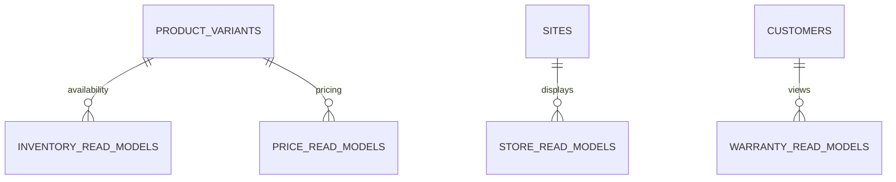

# MongoDB - Integration & Operational Read Models

**Status:** Canonical Draft  
**Scope:** dữ liệu Odoo được chiếu sang Commerce để đọc nhanh + mapping/sync state. Không chứa stock transaction gốc.

## `inventory_read_models`

| Field | Type | Req | Ghi chú |
| --- | --- | --- | --- |
| `_id` | ObjectId | Y | PK |
| `variant_id` | ObjectId | Y | -> `product_variants` |
| `external_variant_id` | string | Y | Odoo variant key |
| `store_key` | string/null | N | store mapping |
| `warehouse_key` | string | Y | warehouse mapping |
| `on_hand_qty` | decimal | Y | read model |
| `reserved_qty` | decimal | Y | read model |
| `available_qty` | decimal | Y | read model |
| `stock_status` | enum | Y | `in_stock`,`low_stock`,`out_of_stock` |
| `source_version` | string/null | N | |
| `source_updated_at` | datetime/null | N | |
| `synced_at` | datetime | Y | |

Indexes: unique `variant_id+warehouse_key`; `store_key+stock_status`; `external_variant_id`; `synced_at`.

## `price_read_models`

| Field | Type | Req | Ghi chú |
| --- | --- | --- | --- |
| `_id` | ObjectId | Y | PK |
| `site_id` | ObjectId | Y | -> `sites` |
| `variant_id` | ObjectId | Y | -> `product_variants` |
| `external_pricelist_id` | string/null | N | Odoo mapping |
| `currency` | string | Y | ISO |
| `list_price` | decimal | Y | |
| `sale_price` | decimal | Y | |
| `discount_amount` | decimal | Y | default 0 |
| `promotion_ids` | array<string> | Y | promotion refs |
| `valid_from` | datetime/null | N | |
| `valid_to` | datetime/null | N | |
| `source_version` | string/null | N | |
| `source_updated_at` | datetime/null | N | |
| `synced_at` | datetime | Y | |

Indexes: unique `site_id+variant_id`; `site_id+sale_price`; `promotion_ids`; `synced_at`.

## `store_read_models`

Store/location operational data từ Odoo phục vụ Storefront/CMS read path.

| Field | Type | Req | Ghi chú |
| --- | --- | --- | --- |
| `_id` | ObjectId | Y | PK |
| `external_store_id` | string | Y | Odoo `bikesport.store` mapping |
| `store_code` | string | Y | stable business code |
| `name` | string | Y | |
| `address` | object | Y | presentation-safe snapshot |
| `phone` | string/null | N | |
| `email` | string/null | N | |
| `latitude` | decimal/null | N | |
| `longitude` | decimal/null | N | |
| `warehouse_keys` | array<string> | Y | mapping theo DEC-008 |
| `opening_hours` | object | Y | presentation/read model |
| `website_visible` | boolean | Y | |
| `source_updated_at` | datetime/null | N | |
| `synced_at` | datetime | Y | |

Indexes: unique `external_store_id`; unique `store_code`; `website_visible`; geospatial index chỉ tạo khi location search được xác nhận.

## `warranty_read_models`

| Field | Type | Req | Ghi chú |
| --- | --- | --- | --- |
| `_id` | ObjectId | Y | PK |
| `external_warranty_id` | string | Y | Odoo warranty case key |
| `customer_id` | ObjectId/null | N | Commerce customer mapping nếu có |
| `order_number` | string/null | N | |
| `order_line_key` | string/null | N | |
| `sku` | string | Y | product snapshot key |
| `serial_or_lot` | string/null | N | phụ thuộc DEC-007 |
| `state` | string | Y | mapped state |
| `issue_summary` | string | Y | presentation-safe summary |
| `resolution_summary` | string/null | N | |
| `received_at` | datetime/null | N | |
| `resolved_at` | datetime/null | N | |
| `source_updated_at` | datetime/null | N | |
| `synced_at` | datetime | Y | |

Indexes: unique `external_warranty_id`; `customer_id+state`; `order_number`; `serial_or_lot`.

## `external_mappings`

| Field | Type | Req | Ghi chú |
| --- | --- | --- | --- |
| `_id` | ObjectId | Y | PK |
| `entity_type` | enum | Y | `product`,`variant`,`customer`,`store`,`warehouse`,`order`,`warranty`,`promotion`,`pricelist` |
| `commerce_id` | string | Y | ObjectId stringify/canonical key |
| `odoo_model` | string | Y | |
| `odoo_id` | integer | Y | |
| `external_key` | string/null | N | stable business key |
| `created_at` | datetime | Y | |
| `updated_at` | datetime | Y | |

Indexes: unique `entity_type+commerce_id`; unique `odoo_model+odoo_id`; sparse `entity_type+external_key`.

## `sync_checkpoints`

| Field | Type | Req | Ghi chú |
| --- | --- | --- | --- |
| `_id` | ObjectId | Y | PK |
| `domain` | enum | Y | `product`,`inventory`,`price`,`promotion`,`customer`,`order`,`store`,`warranty` |
| `direction` | enum | Y | `odoo_to_commerce`,`commerce_to_odoo` |
| `cursor` | string/null | N | |
| `last_success_at` | datetime/null | N | |
| `last_run_at` | datetime/null | N | |
| `status` | enum | Y | `idle`,`running`,`failed` |
| `updated_at` | datetime | Y | |

Index: unique `domain+direction`.

## `sync_failures`

| Field | Type | Req | Ghi chú |
| --- | --- | --- | --- |
| `_id` | ObjectId | Y | PK |
| `domain` | string | Y | |
| `direction` | enum | Y | |
| `source_key` | string | Y | |
| `target_key` | string/null | N | |
| `event_key` | string/null | N | idempotency/event identity |
| `payload_hash` | string/null | N | |
| `error_code` | string | Y | stable code |
| `error_message` | string | Y | sanitized |
| `attempt_count` | integer | Y | >=1 |
| `status` | enum | Y | `open`,`retrying`,`resolved`,`ignored` |
| `first_failed_at` | datetime | Y | |
| `last_failed_at` | datetime | Y | |
| `resolved_at` | datetime/null | N | |

Indexes: `domain+status+last_failed_at`; `source_key+status`; sparse unique `event_key+direction` nếu event key được chốt.

## Rules

- Read model không phải source of truth.
- Không được update `inventory_read_models` từ CMS/Storefront.
- Sync phải idempotent theo contract `INT-*`; retry không được tạo duplicate business entity.
- Mọi mapping Odoo-Commerce phải qua stable identifier, không map bằng display name.
