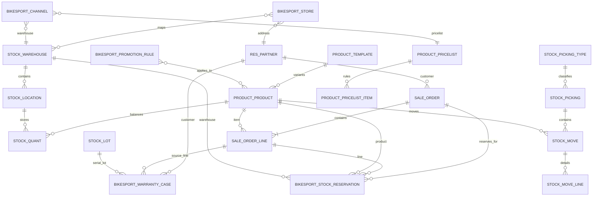

# Odoo / PostgreSQL Schema

**Status:** Canonical Draft  
**Owner:** Odoo Back-office  
**Rule:** ưu tiên reuse standard Odoo model. Chỉ các custom BikeSport model dưới đây mới được tạo thêm.

## Standard Odoo model/table registry

| Domain | Odoo model | PostgreSQL table | Vai trò |
| --- | --- | --- | --- |
| Product template | `product.template` | `product_template` | Product-level ERP data |
| Product variant | `product.product` | `product_product` | SKU/variant |
| Customer/contact/address | `res.partner` | `res_partner` | Customer/contact/address |
| Warehouse | `stock.warehouse` | `stock_warehouse` | Warehouse |
| Location | `stock.location` | `stock_location` | Internal/customer/vendor/store location |
| Stock balance | `stock.quant` | `stock_quant` | Qty theo product/location |
| Stock move | `stock.move` | `stock_move` | Stock movement |
| Stock move detail | `stock.move.line` | `stock_move_line` | Lot/serial/location movement |
| Picking | `stock.picking` | `stock_picking` | Receipt/delivery/internal transfer |
| Picking type | `stock.picking.type` | `stock_picking_type` | Operation type |
| Lot/Serial | `stock.lot` | `stock_lot` | Lot/serial |
| Sales order | `sale.order` | `sale_order` | Back-office order |
| Sales order line | `sale.order.line` | `sale_order_line` | Order item |
| Pricelist | `product.pricelist` | `product_pricelist` | Price list |
| Pricelist item | `product.pricelist.item` | `product_pricelist_item` | Price rule/item |
| Staff user | `res.users` | `res_users` | User |
| Staff group | `res.groups` | `res_groups` | Role/group |
| Model access | `ir.model.access` | `ir_model_access` | CRUD ACL |
| Record rule | `ir.rule` | `ir_rule` | Row/record ACL |

**Không tạo custom table thay thế các model chuẩn này nếu chưa có requirement buộc phải thay.**

---

## Custom model registry

| Odoo model | PostgreSQL table | Trách nhiệm |
| --- | --- | --- |
| `bikesport.store` | `bikesport_store` | Cửa hàng/địa điểm vận hành |
| `bikesport.store.warehouse.rel` | `bikesport_store_warehouse_rel` | many-to-many Store ↔ Warehouse nếu DEC-008 chốt cần |
| `bikesport.stock.reservation` | `bikesport_stock_reservation` | reservation workflow |
| `bikesport.warranty.case` | `bikesport_warranty_case` | bảo hành |
| `bikesport.promotion.rule` | `bikesport_promotion_rule` | business promotion rule nếu Odoo là owner |
| promotion-product relation | `bikesport_promotion_product_rel` | promotion ↔ product |
| `bikesport.channel` | `bikesport_channel` | multi-site/channel mapping |

## `bikesport.store` -> `bikesport_store`

| Field | Odoo type | Req | Relation/Ghi chú |
| --- | --- | --- | --- |
| `id` | integer | Y | PK |
| `code` | Char | Y | unique |
| `name` | Char | Y | |
| `partner_id` | Many2one | Y | -> `res.partner` |
| `primary_warehouse_id` | Many2one | N | -> `stock.warehouse` |
| `website_visible` | Boolean | Y | default false |
| `active` | Boolean | Y | |
| `create_date` | Datetime | Auto | audit |
| `write_date` | Datetime | Auto | audit |

Constraints/indexes: unique `code`; index `primary_warehouse_id`; index `website_visible+active`.

## `bikesport.store.warehouse.rel` -> `bikesport_store_warehouse_rel`

Chỉ dùng nếu DEC-008 xác nhận 1 Store có nhiều Warehouse.

| Column | Type | Req | Relation |
| --- | --- | --- | --- |
| `store_id` | integer | Y | FK `bikesport_store.id` |
| `warehouse_id` | integer | Y | FK `stock_warehouse.id` |

Constraint: unique `(store_id, warehouse_id)`.

## `bikesport.stock.reservation` -> `bikesport_stock_reservation`

| Field | Odoo type | Req | Relation/Ghi chú |
| --- | --- | --- | --- |
| `id` | integer | Y | PK |
| `reference` | Char | Y | unique |
| `sale_order_id` | Many2one | N | -> `sale.order` |
| `sale_order_line_id` | Many2one | N | -> `sale.order.line` |
| `product_id` | Many2one | Y | -> `product.product` |
| `warehouse_id` | Many2one | Y | -> `stock.warehouse` |
| `location_id` | Many2one | N | -> `stock.location` |
| `quantity` | Float | Y | > 0 |
| `state` | Selection | Y | `draft`,`reserved`,`released`,`consumed`,`cancelled` |
| `reserved_at` | Datetime | N | |
| `expires_at` | Datetime | N | nếu có hold expiry |
| `released_at` | Datetime | N | |
| `release_reason` | Text | N | |
| `create_date` | Datetime | Auto | audit |
| `write_date` | Datetime | Auto | audit |

Constraints/indexes: unique `reference`; check `quantity > 0`; index `product_id+warehouse_id+state`; index `sale_order_id+state`; index `expires_at` nếu dùng expiry.

## `bikesport.warranty.case` -> `bikesport_warranty_case`

| Field | Odoo type | Req | Relation/Ghi chú |
| --- | --- | --- | --- |
| `id` | integer | Y | PK |
| `code` | Char | Y | unique |
| `partner_id` | Many2one | Y | -> `res.partner` |
| `sale_order_id` | Many2one | N | -> `sale.order` |
| `sale_order_line_id` | Many2one | N | -> `sale.order.line` |
| `product_id` | Many2one | Y | -> `product.product` |
| `lot_id` | Many2one | N | -> `stock.lot`; mandatory phụ thuộc DEC-007 |
| `store_id` | Many2one | N | -> `bikesport.store` |
| `state` | Selection | Y | `draft`,`received`,`inspecting`,`approved`,`rejected`,`repairing`,`completed`,`cancelled` |
| `issue_description` | Text | Y | |
| `resolution` | Text | N | |
| `received_at` | Datetime | N | |
| `resolved_at` | Datetime | N | |
| `create_date` | Datetime | Auto | audit |
| `write_date` | Datetime | Auto | audit |

Constraints/indexes: unique `code`; index `partner_id+state`; index `sale_order_line_id`; index `lot_id`.

## `bikesport.promotion.rule` -> `bikesport_promotion_rule`

Chỉ activate như business rule source nếu DEC-003 xác nhận Odoo sở hữu calculation.

| Field | Odoo type | Req | Ghi chú |
| --- | --- | --- | --- |
| `id` | integer | Y | PK |
| `code` | Char | Y | unique |
| `name` | Char | Y | |
| `active` | Boolean | Y | |
| `priority` | Integer | Y | default 0 |
| `valid_from` | Datetime | N | |
| `valid_to` | Datetime | N | |
| `rule_type` | Selection | Y | `product`,`category`,`order` |
| `discount_type` | Selection | Y | `percent`,`fixed_amount`,`fixed_price` |
| `discount_value` | Float | Y | >= 0 |
| `min_quantity` | Float | N | |
| `pricelist_id` | Many2one | N | -> `product.pricelist` |
| `create_date` | Datetime | Auto | audit |
| `write_date` | Datetime | Auto | audit |

Constraints/indexes: unique `code`; check `discount_value >= 0`; index `active+valid_from+valid_to+priority`.

## `bikesport_promotion_product_rel`

| Column | Type | Req | Relation |
| --- | --- | --- | --- |
| `promotion_id` | integer | Y | FK `bikesport_promotion_rule.id` |
| `product_id` | integer | Y | FK `product_product.id` |

Constraint: unique `(promotion_id, product_id)`.

## `bikesport.channel` -> `bikesport_channel`

| Field | Odoo type | Req | Relation/Ghi chú |
| --- | --- | --- | --- |
| `id` | integer | Y | PK |
| `code` | Char | Y | unique |
| `name` | Char | Y | |
| `external_site_key` | Char | Y | unique; map Commerce site |
| `pricelist_id` | Many2one | N | -> `product.pricelist` |
| `default_warehouse_id` | Many2one | N | -> `stock.warehouse` |
| `active` | Boolean | Y | |
| `create_date` | Datetime | Auto | audit |
| `write_date` | Datetime | Auto | audit |

Indexes: unique `code`; unique `external_site_key`; index `default_warehouse_id`.

## ERD

## Schema-change rule

Nếu task cần custom model/table/field khác: tạo `DATA-CHG-xxx`, sửa file này trước, xác định migration/ACL/index/integration impact rồi mới implement.