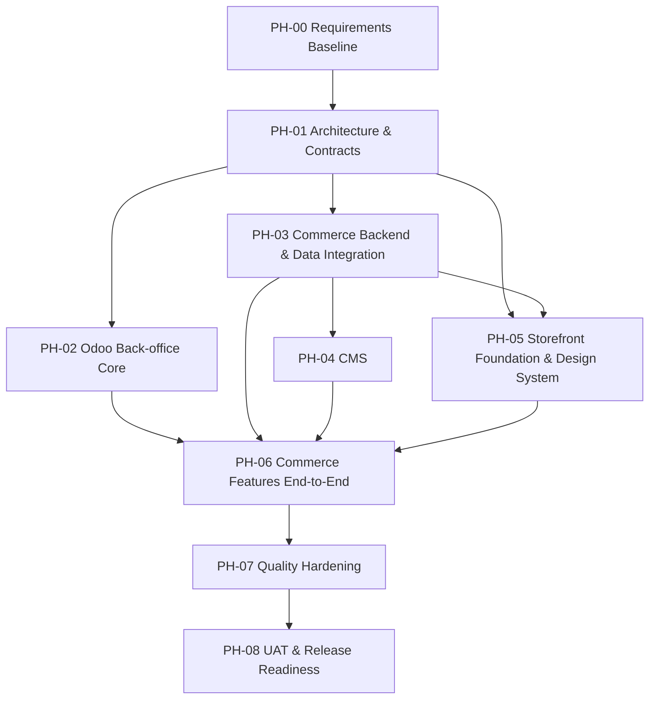

# Engineering Delivery Plan

**Trạng thái:** Proposed - cần xác nhận trước khi dùng làm kế hoạch thực thi chính thức.

## 1. Mục tiêu

Chia BikeSport thành các phase và work package có dependency rõ ràng để nhiều agent/developer có thể làm song song mà không tự ý chồng trách nhiệm giữa Storefront, CMS, Commerce Backend và Odoo.

## 2. Nguyên tắc lập phase

- Phase được sắp theo dependency kỹ thuật, không phải cam kết timeline.
- Một phase chỉ được chuyển sang `Ready` khi input bắt buộc đã có.
- Các hạng mục có thể chạy song song nếu contract giữa chúng đã được khóa.
- Security, performance và data integrity là quality gate xuyên phase, không phải việc để cuối dự án mới làm.

## 3. Phase map đề xuất

## 4. Chi tiết phase

### PH-00 - Requirements Baseline

**Mục tiêu:** chốt đủ phạm vi để không thiết kế trên giả định mơ hồ.

**Input:** BRD, FRD, SRS draft, process flow, open questions.  
**Output bắt buộc:**

- Domain scope được thống nhất.
- Actor/role chính được xác định.
- Data ownership các entity quan trọng được chốt hoặc đánh dấu rõ TBD.
- Các business rule ảnh hưởng Order, Inventory, Pricing, Promotion, Warranty được nhận diện.

**Exit gate:** không còn câu hỏi mở nào có khả năng làm thay đổi toàn bộ system boundary mà vẫn bị giấu trong requirement.

### PH-01 - Architecture & Contracts

**Mục tiêu:** xác định ranh giới hệ thống và contract để các team/agent có thể làm độc lập.

**Work packages:**

| ID | Hạng mục | Output |
| --- | --- | --- |
| ARCH-001 | System boundary | Context/container diagram và responsibility map |
| DATA-001 | Data ownership | Source of truth matrix |
| DATA-002 | Logical data model | Entity relationship ở mức logical, chưa khóa physical schema nếu chưa cần |
| INT-001 | Commerce-Odoo contract | Data/event/API contract và failure behavior |
| SEC-001 | Security model | Trust boundary, authn/authz scope, sensitive data classification |
| PERF-001 | Performance budget | Các luồng cần benchmark và target còn TBD/đã chốt |

**Exit gate:** agent làm Storefront/CMS/Odoo/Backend biết dữ liệu nào được đọc, dữ liệu nào được ghi và contract nào không được tự thay đổi.

### PH-02 - Odoo Back-office Core

**Phạm vi đề xuất:**

- Product/ERP-side data theo ownership đã chốt.
- Warehouse, stock, nhập/xuất/chuyển kho.
- Reservation.
- Order back-office lifecycle.
- Warranty.
- Store/location.
- Staff permission trong Odoo.
- Pricing/promotion phần thuộc Odoo nếu được xác nhận.

**Không tự bao gồm:** UI storefront, CMS content, MongoDB catalog presentation.

### PH-03 - Commerce Backend & Data Integration

**Phạm vi đề xuất:**

- Commerce API/application service.
- MongoDB persistence thuộc Commerce.
- Mapping giữa Commerce model và Odoo model.
- Đồng bộ, reconciliation, error handling và idempotency khi requirement yêu cầu.
- API/contract phục vụ Storefront và CMS.

**Exit gate:** integration contract có test/evidence cho happy path và failure path quan trọng.

### PH-04 - CMS

**Phạm vi đề xuất:**

- Quản trị nội dung web.
- Thuộc tính sản phẩm linh hoạt thuộc Commerce.
- Media, SEO, merchandising/presentation.
- Các chức năng support/view liên quan Order/Inventory chỉ khi SRS cho phép.

**Ràng buộc:** CMS không được trở thành hệ thống thứ hai tự sở hữu Inventory/Reservation/ERP transaction nếu ownership không cho phép.

### PH-05 - Storefront Foundation & Design System

**Phạm vi đề xuất:**

- App shell/layout foundation.
- Design token foundation.
- Typography, spacing, color semantics, radius, elevation, motion.
- Primitive/component contracts.
- Responsive rules.
- Accessibility foundation.
- API client/error/loading/empty state conventions.

**Exit gate:** feature agent có thể dựng page mới mà không tự tạo màu, spacing, typography hoặc component pattern riêng ngoài design system.

### PH-06 - Commerce Features End-to-End

Triển khai theo vertical slice để kiểm chứng toàn luồng thay vì hoàn thành từng subsystem cô lập.

Các slice dự kiến:

- Catalog/Product Detail.
- Pricing/Promotion presentation.
- Store availability.
- Cart/Checkout/Order.
- Order tracking/support.
- Warranty flow nếu thuộc customer-facing scope.

Mỗi slice phải trace về BR/FR/SRS và có integration test tương ứng.

### PH-07 - Quality Hardening

Bao gồm:

- Security verification.
- Performance/load verification.
- Recovery/reconciliation test.
- Accessibility audit.
- Cross-browser/device validation nếu thuộc scope.
- Logging/monitoring/operability review.

Không được coi đây là lần đầu tiên security/performance được xem xét; phase này là bước xác nhận cuối dựa trên evidence.

### PH-08 - UAT & Release Readiness

**Output:**

- UAT result.
- Known issues/risk register.
- Release checklist.
- Migration/cutover plan nếu có.
- Rollback/recovery plan nếu có.
- Tài liệu vận hành cần thiết.

## 5. Trạng thái phase

Dùng một trong các trạng thái:

- `Not Started`
- `Blocked`
- `Ready`
- `In Progress`
- `Verification`
- `Done`

`Done` chỉ dùng khi exit criteria của phase đã có bằng chứng; không dùng vì "code đã viết xong".
