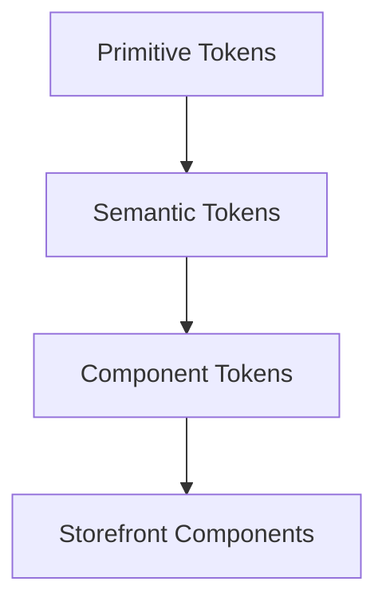
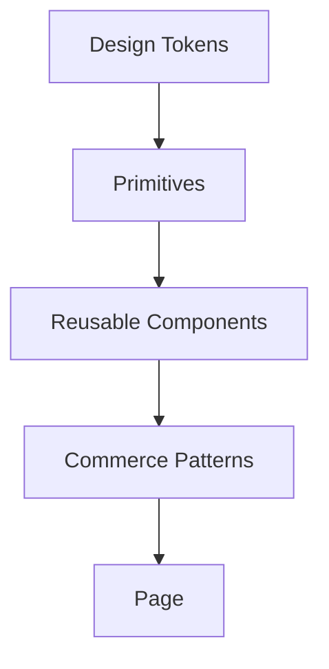

# Storefront Design System

**Trạng thái:** Draft  
**Mục tiêu:** tạo một contract UI chung để mọi agent phát triển Storefront dùng cùng ngôn ngữ thiết kế, không tự hard-code style hoặc tạo component pattern riêng cho từng màn hình.

## 1. Phạm vi

Design system của Storefront bao gồm:

- design tokens;
- typography;
- spacing/layout;
- color semantics;
- radius/elevation;
- motion;
- responsive behavior;
- primitive components;
- reusable UI components;
- interaction states;
- accessibility states;
- content/state conventions như loading, empty, error, disabled.

Tài liệu này chưa khóa framework UI hoặc giá trị token cụ thể vì chưa có nguồn xác nhận.

## 2. Token architecture

Token nên chia thành ba lớp để tránh component dùng trực tiếp giá trị thô.



### Layer 1 - Primitive tokens

Các giá trị cơ bản chưa mang ý nghĩa UI cụ thể:

- color palette;
- font family;
- font size/line height/weight;
- spacing scale;
- radius scale;
- shadow/elevation scale;
- breakpoint scale;
- motion duration/easing.

Ví dụ naming đề xuất, chưa phải giá trị đã chốt:

```text
color.neutral.*
color.brand.*
space.*
font.size.*
font.weight.*
radius.*
shadow.*
breakpoint.*
motion.duration.*
```

### Layer 2 - Semantic tokens

Semantic token mô tả vai trò thay vì màu/số cụ thể:

```text
surface.default
surface.subtle
surface.inverse
text.primary
text.secondary
text.disabled
border.default
border.strong
action.primary.background
action.primary.text
feedback.success
feedback.warning
feedback.error
focus.ring
```

Component không nên gọi trực tiếp `color.brand.500` nếu ý nghĩa thực tế là `action.primary.background`.

### Layer 3 - Component tokens

Chỉ tạo khi một component thực sự cần contract riêng, ví dụ:

```text
button.primary.background.default
button.primary.background.hover
button.primary.text.default
card.product.radius
card.product.spacing
input.border.focus
```

Không tạo component token nếu semantic token đã đủ.

## 3. Component hierarchy

Đề xuất chia component theo trách nhiệm:

| Nhóm | Ví dụ |
| --- | --- |
| Primitive | Button, Input, Select, Checkbox, Radio, Icon, Text |
| Layout | Container, Stack, Grid, Section |
| Feedback | Alert, Toast, Skeleton, Spinner, EmptyState |
| Commerce | ProductCard, Price, PromotionBadge, StockStatus, QuantitySelector |
| Navigation | Header, Breadcrumb, Pagination, Tabs |
| Form/Checkout | FormField, AddressForm, ShippingOption, PaymentOption |

Tên cụ thể có thể thay đổi khi implementation stack được chốt.

## 4. State contract

Mỗi interactive component phải xác định các state áp dụng:

- default;
- hover;
- focus-visible;
- active/pressed;
- disabled;
- loading;
- error/invalid khi có;
- selected/checked khi có.

Agent không được bỏ focus state chỉ vì mockup không vẽ riêng.

## 5. Responsive contract

Trước khi page/component được coi là hoàn thành cần xác định:

- container behavior;
- grid behavior;
- breakpoint behavior;
- content priority khi màn hình hẹp;
- image/media ratio;
- overflow/long text behavior;
- touch target khi áp dụng.

Breakpoint cụ thể hiện là `TBD`; agent không được tự coi breakpoint riêng của một page là chuẩn toàn hệ thống.

## 6. Storefront page contract

Mỗi page nên dùng lại các foundation sau thay vì tự dựng riêng:



Ví dụ Product Detail không nên tự định nghĩa lại button, price style, stock status hoặc spacing nếu các contract đó đã tồn tại.

## 7. Token source of truth

Cần chốt một nơi duy nhất làm nguồn token chính. Hiện trạng: **TBD**.

Khi implementation được quyết định, source of truth phải đáp ứng:

- token được version control;
- component sử dụng token thay vì copy giá trị;
- thay đổi token có thể trace;
- không duy trì hai bộ token độc lập không có cơ chế sync;
- có mapping rõ giữa design artifact và code nếu dùng công cụ thiết kế ngoài repository.

## 8. Design System quality gate

| ID | Điều kiện | Evidence | Status |
| --- | --- | --- | --- |
| DS-GATE-001 | Không hard-code visual value ngoài trường hợp được phê duyệt | Code review/static check TBD | Blocked |
| DS-GATE-002 | Component dùng semantic token phù hợp | Component review | Blocked |
| DS-GATE-003 | Interactive component có state cần thiết | Story/component test TBD | Blocked |
| DS-GATE-004 | Page dùng reusable component khi contract đã tồn tại | Review | Blocked |
| DS-GATE-005 | Responsive behavior được kiểm chứng | Visual/device test TBD | Blocked |
| DS-GATE-006 | Accessibility state được kiểm chứng | Accessibility evidence TBD | Blocked |

## 9. Task rule cho Storefront agent

Khi agent gặp giá trị/style chưa có trong design system:

1. Kiểm tra semantic token hiện có.
2. Nếu không có, xác định đây là thiếu token hay ngoại lệ của component.
3. Không tự thêm giá trị hard-code vào page rồi bỏ qua design system.
4. Nếu cần token mới, tạo task `DS-xxx` hoặc cập nhật design-system contract trong cùng change nếu task cho phép.
5. Ghi ảnh hưởng tới component/page đang dùng token đó.

## 10. Các quyết định còn mở

- Visual direction/brand palette.
- Typography family và scale.
- Spacing scale.
- Breakpoints.
- Radius/elevation system.
- Light/dark theme có thuộc scope hay không.
- Framework/component library nếu có.
- Token source of truth và định dạng lưu token.
- Tooling kiểm tra hard-coded values.

Các mục trên chưa được xác nhận nên không được xem là requirement đã chốt.
