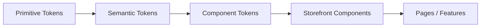

# BikeSport Storefront Design System

**Trạng thái:** Draft - structure defined, visual values chưa có nguồn để khóa.  
**Task liên quan:** `DS-001` đến `DS-005` trong `project-task-board.md`.

## 1. Mục tiêu

Storefront phải có một nguồn token dùng chung. Page/feature agent không được tự tạo màu, spacing, font-size, radius hoặc breakpoint riêng trong từng màn hình.

Design System của BikeSport gồm 3 lớp:



## 2. Cấu trúc file dự kiến

Khi Storefront repository được khởi tạo, token nên nằm trong một vùng duy nhất:

```text
storefront/
  src/
    design-system/
      tokens/
        primitive.tokens.*
        semantic.tokens.*
        component.tokens.*
      components/
        Button/
        Input/
        Select/
        ProductCard/
        Price/
        StockStatus/
        PromotionBadge/
        QuantitySelector/
      layouts/
        Container/
        Grid/
        Stack/
        Section/
```

Dấu `*` vì format cuối cùng (JSON/TS/CSS variables/tool-generated) chưa được chốt. Agent không được tự tạo thêm một bộ token thứ hai ở page folder.

## 3. Primitive tokens bắt buộc

Đây là các giá trị gốc. **Giá trị cụ thể chưa được tự bịa khi chưa có design/brand input.**

```text
color.brand.*
color.neutral.*
color.red.*
color.green.*
color.yellow.*

font.family.body
font.family.heading
font.size.*
font.weight.*
font.lineHeight.*

space.*
radius.*
shadow.*
breakpoint.*
motion.duration.*
motion.easing.*
```

### Task DS-001

Chốt naming + format + source of truth cho token.

### Task DS-002

Điền giá trị thật cho:

- brand palette;
- neutral palette;
- typography;
- spacing scale;
- radius;
- shadow;
- breakpoint;
- motion.

Task chỉ được `DONE` khi giá trị có nguồn từ design/brand decision.

## 4. Semantic tokens Storefront phải có

Component/page dùng semantic token trước, không gọi primitive trực tiếp nếu semantic đã tồn tại.

### Surface

```text
surface.page
surface.section
surface.card
surface.subtle
surface.inverse
surface.overlay
```

### Text

```text
text.primary
text.secondary
text.muted
text.inverse
text.disabled
text.link
text.price
text.priceOriginal
```

### Border

```text
border.default
border.subtle
border.strong
border.focus
border.error
```

### Actions

```text
action.primary.bg
action.primary.text
action.primary.hover
action.primary.disabled

action.secondary.bg
action.secondary.text
action.secondary.border
action.secondary.hover
```

### Commerce states

```text
stock.inStock.text
stock.lowStock.text
stock.outOfStock.text

promotion.badge.bg
promotion.badge.text

price.current.text
price.original.text
price.discount.text
```

### Feedback

```text
feedback.success.bg
feedback.success.text
feedback.warning.bg
feedback.warning.text
feedback.error.bg
feedback.error.text
feedback.info.bg
feedback.info.text
focus.ring
```

## 5. Component tokens

Chỉ tạo khi semantic token chưa đủ mô tả component.

### Button

```text
button.height.sm
button.height.md
button.height.lg
button.paddingX.sm
button.paddingX.md
button.paddingX.lg
button.radius
```

Màu button dùng `action.primary.*` / `action.secondary.*`, không cần copy thành một bộ màu khác nếu không có lý do.

### Input

```text
input.height
input.paddingX
input.radius
input.border.default
input.border.focus
input.border.error
input.text
input.placeholder
```

### ProductCard

```text
productCard.radius
productCard.gap
productCard.imageRatio
productCard.padding
productCard.titleLines
```

### Commerce components

```text
price.gap
promotionBadge.radius
promotionBadge.paddingX
stockStatus.gap
quantitySelector.height
quantitySelector.buttonSize
```

## 6. Component inventory cần build

### Foundation - DS-003

- Button
- Link
- Input
- Textarea
- Select
- Checkbox
- Radio
- Icon
- Badge
- Skeleton
- Spinner
- Alert
- EmptyState

### Layout - DS-004

- Container
- Stack
- Inline
- Grid
- Section
- Divider

### Commerce - DS-005

- ProductCard
- ProductImageGallery
- Price
- PromotionBadge
- StockStatus
- VariantSelector
- QuantitySelector
- CartLineItem
- OrderSummary
- StoreAvailability

## 7. Component state matrix

| Component | Default | Hover | Focus-visible | Disabled | Loading | Error/Invalid | Selected |
| --- | --- | --- | --- | --- | --- | --- | --- |
| Button | Required | Required | Required | Required | Required | - | - |
| Input | Required | Optional | Required | Required | - | Required | - |
| Select | Required | Optional | Required | Required | - | Required | Required |
| Checkbox/Radio | Required | Optional | Required | Required | - | Required khi form cần | Required |
| VariantSelector | Required | Required | Required | Required | - | Required khi unavailable | Required |
| QuantitySelector | Required | Required | Required | Required | Optional | Required khi vượt giới hạn | - |

Task DS-003/005 không được `DONE` nếu thiếu state bắt buộc.

## 8. Page nào dùng component nào

| Storefront task | Component chính |
| --- | --- |
| `SF-002` Product Listing | Container, Grid, ProductCard, Price, StockStatus, PromotionBadge |
| `SF-003` Product Detail | ProductImageGallery, Price, VariantSelector, StockStatus, QuantitySelector, Button |
| `SF-004` Store | StoreAvailability, Card/List, Button/Link |
| `SF-005` Cart | CartLineItem, QuantitySelector, Price, OrderSummary |
| `SF-006` Checkout | Input, Select, Radio, Checkbox, OrderSummary, Button, Alert |
| `SF-007` Order Status | Badge/Status, Price, OrderSummary, Alert |

Nếu agent cần component mới, thêm task `DS-*` hoặc mở rộng task hiện tại có ghi rõ scope; không tạo local component trùng chức năng mà không cập nhật design system.

## 9. Responsive tokens

Breakpoint values chưa được chốt, nhưng contract phải có một bộ duy nhất:

```text
breakpoint.sm
breakpoint.md
breakpoint.lg
breakpoint.xl
```

Các page `SF-*` không được tự định nghĩa breakpoint khác ngoài bộ này khi DS-002 đã hoàn tất.

## 10. Status tracking

| ID | Hạng mục | Status | Evidence |
| --- | --- | --- | --- |
| DS-001 | Token architecture/naming/format | `BLOCKED` | Chưa có decision về format/source |
| DS-002 | Giá trị token thực tế | `BLOCKED` | Chưa có design/brand input |
| DS-003 | Foundation components | `BLOCKED` | Chờ DS-001/002 |
| DS-004 | Layout primitives | `BLOCKED` | Chờ DS-001/002 |
| DS-005 | Commerce components | `BLOCKED` | Chờ DS-003 + Backend contracts |

Khi implementation bắt đầu, trạng thái trong bảng này và `project-task-board.md` phải được cập nhật cùng nhau.
