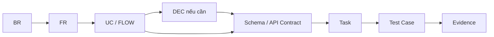

# BikeSport Requirements Traceability Matrix

**Trạng thái:** Active Draft  
**Mục tiêu:** truy vết từ business requirement đến use case, architecture/schema, implementation task và test evidence. Một capability không được coi là hoàn thành nếu chuỗi trace bị đứt ở requirement, task hoặc test.

## 1. Traceability matrix

| Business Objective | BR | FR | Use Case / Flow | System / Schema / Interface | Implementation Task | Test Case / Evidence | Status |
| --- | --- | --- | --- | --- | --- | --- | --- |
| BO-001 | BR-001 | FR-001 | UC-CAT-001 | Storefront SRS, BE Product API, `products`, `product_variants` | BE-003, SF-002, SF-003 | TC-CAT-001 | BLOCKED |
| BO-002 | BR-010 | FR-002 | UC-CAT-001 | `product_types.attribute_definitions`, `products.attributes` | BE-004, CMS-003, SF-003 | TC-CAT-002 | BLOCKED |
| BO-001 | BR-002 | FR-003 | UC-CAT-001 | CMS SRS, Product field ownership | CMS-002, BE-016 | TC-CAT-003, TC-AUTH-005 | BLOCKED DEC-005 |
| BO-001 | BR-003 | FR-010 | UC-INV-001 | Odoo `stock.warehouse`, `stock.location` | ODOO-003 | TC-INV-001/003 | NOT STARTED |
| BO-001 | BR-003 | FR-011 | UC-INV-001 | Odoo stock picking/move/move line | ODOO-005..008 | TC-INV-001..003 | NOT STARTED |
| BO-001 | BR-003 | FR-012 | UC-INV-001 | Custom stock workflow + Odoo stock models | ODOO-005 | TC-INV-001..003 | NOT STARTED |
| BO-001 | BR-003 | FR-013 | UC-RES-001 | `bikesport_stock_reservation`, INT-002/004 | ODOO-009, BE-011/012 | TC-RES-001..006, DQ-003 | BLOCKED |
| BO-001 | BR-003 | FR-014 | UC-INV-001 | `inventory_read_models`, INT-002 | INT-002, BE-008 | TC-INV-005, DQ-002 | BLOCKED |
| BO-001 | BR-004 | FR-020 | UC-ORD-001 / FLOW-001 | Storefront Checkout, `orders`, `sale.order` | BE-010..012, SF-005/006 | TC-ORD-001..004 | BLOCKED DEC-004 |
| BO-001 | BR-004 | FR-021 | UC-ORD-001 / FLOW-001 | INT-004, reservation/order mapping | ODOO-009/010, BE-012/013 | TC-ORD-003..008, E2E-003 | BLOCKED DEC-004 |
| BO-001 | BR-004 | FR-022 | UC-AUTH-001 | CMS Order Support + API authorization | CMS-008, BE-016 | TC-ORD-007 | BLOCKED DEC-006 |
| BO-001 | BR-007 | FR-030 | UC-PRICE-001 | `price_read_models`, promotion models, INT-003 | ODOO-011/012, BE-009 | TC-PRICE-001..006, DQ-004 | BLOCKED DEC-002/003 |
| BO-001 | BR-007 | FR-031 | UC-PRICE-001 | Product/Checkout pricing contract | BE-009..011, SF-003/006 | TC-PRICE-004..006, E2E-004 | BLOCKED |
| BO-001 | BR-005 | FR-040 | UC-WAR-001 | `bikesport_warranty_case`, INT-005 | ODOO-013, BE-015 | TC-WAR-001/002/005 | BLOCKED DEC-007 |
| BO-001 | BR-005 | FR-041 | UC-WAR-001 / UC-AUTH-001 | Warranty API + permission | ODOO-001, BE-015/016 | TC-WAR-003/004 | BLOCKED DEC-006/007 |
| BO-001 | BR-006 | FR-050 | Store flow TBD | `bikesport_store`, Store-Warehouse mapping | ODOO-002, BE-014 | E2E-006 | BLOCKED DEC-008 |
| BO-001 | BR-006 | FR-051 | UC-CAT-001 related display | Store API / Storefront | BE-014, SF-004 | E2E-006 | BLOCKED |
| BO-001 | BR-008 | FR-060 | UC-AUTH-001 | Odoo groups/rules + CMS auth | ODOO-001, CMS-001, BE-016 | TC-AUTH-001..008, SEC-002 | BLOCKED DEC-006 |
| BO-001 | BR-008 | FR-061 | UC-AUTH-001 | Server-side authorization | BE-016, ODOO-001 | TC-AUTH-002..006 | BLOCKED DEC-006 |
| BO-004 | BR-009 | FR-070 | UC-CAT-001 / multi-site flow TBD | `sites`, `product_site_overrides`, channel mapping | ODOO-014, BE-006, CMS-007 | TC-CAT-004, E2E-005 | BLOCKED |
| BO-004 | BR-009 | FR-071 | multi-site flow TBD | shared/override rule | BE-006, CMS-007 | TC-CAT-004 | BLOCKED |

## 2. Engineering trace rules

- Nếu FR chưa có use case/flow nhưng behavior đủ đơn giản, có thể trace trực tiếp FR -> SRS/Task/Test; phải ghi rõ lý do.
- Nếu task thay đổi schema, phải trace qua `DATA-CHG-*`.
- Nếu task phụ thuộc decision `OPEN`, task phải `BLOCKED`.
- Test case không có requirement/task cha là orphan test và phải được sửa.
- Task `DONE` nhưng test/evidence chưa có là trace defect.

## 3. Traceability defects hiện tại

| Gap | Ảnh hưởng | Hành động |
| --- | --- | --- |
| DEC-001..010 chưa chốt | Nhiều task không đủ Definition of Ready | Giữ BLOCKED và cập nhật decision log khi có quyết định |
| Role/permission matrix chưa có | Không thể khóa authz và test access | Hoàn thành DEC-006 trước ODOO-001/CMS-001/BE-016 |
| Order System of Record chưa chốt | `orders` physical behavior và INT-004 chưa thể khóa | Hoàn thành DEC-004 |
| Pricing/Promotion authority chưa chốt | Giá hiển thị/order có nguy cơ khác rule | Hoàn thành DEC-002/003 |
| Reservation expiry/cancel rule chưa chốt | TC-RES-005, TC-ORD-008 bị block | Bổ sung business rule/decision |
| Warranty lifecycle chưa chốt | Warranty state test chưa đầy đủ | Bổ sung rule sau DEC-007 |
| Performance target chưa có | Không thể kết luận PERF pass/fail | Bổ sung measurable NFR |

## 4. Definition of traceability complete

Một epic/capability được coi là trace đầy đủ khi có chuỗi tối thiểu:

`BR -> FR -> UC/FLOW -> Schema/API -> Task -> Test -> Evidence`

Nếu có quyết định kiến trúc/nghiệp vụ ảnh hưởng behavior thì thêm `DEC` vào chuỗi.
