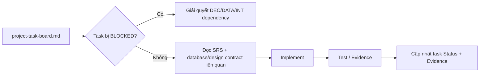

# BikeSport Requirements Documentation

**Trạng thái:** Draft  
**Nhánh:** `docs/T001-requirements-20260815-0955`

## Cấu trúc tài liệu

- `01-business/BRD.md`: mục tiêu, phạm vi và yêu cầu nghiệp vụ.
- `02-functional/FRD.md`: chức năng theo domain.
- `03-system/system-context.md`: Storefront, CMS, Commerce Backend, Odoo và ranh giới hệ thống.
- `03-system/data-ownership.md`: source of truth và quyền ghi dữ liệu.
- `03-system/SRS-Storefront.md`: yêu cầu Storefront.
- `03-system/SRS-Commerce-Backend.md`: yêu cầu Commerce Backend.
- `03-system/SRS-CMS.md`: yêu cầu CMS.
- `03-system/SRS-Odoo-Backoffice.md`: yêu cầu Odoo Back-office.
- `04-integration/INT-Odoo-Commerce.md`: tích hợp Odoo - Commerce.
- `05-process-flows/FLOW-001-order-to-fulfillment.md`: luồng Order ban đầu.
- `06-engineering/project-task-board.md`: **danh sách phase/task thực tế, dependency, trạng thái và evidence**.
- `06-engineering/database-architecture.md`: **schema logic MongoDB + Odoo/PostgreSQL và quan hệ dữ liệu**.
- `06-engineering/storefront-design-system.md`: **token architecture + component inventory cho Storefront**.
- `07-traceability/requirements-matrix.md`: truy vết requirement.

## Khi bắt đầu một task

Task code không được đánh dấu `DONE` chỉ vì đã viết code. Phải có evidence tương ứng trong `project-task-board.md`.

## Trạng thái hiện tại

Repository chưa có implementation nên:

- Odoo/Backend/CMS/Storefront: chưa triển khai.
- Security: chưa kiểm chứng.
- Performance: chưa kiểm chứng.
- Database physical schema: chưa khóa.
- Design token values: chưa khóa.

Các điểm đang khóa kiến trúc được theo dõi bằng `DEC-001` đến `DEC-010` trong task board.
