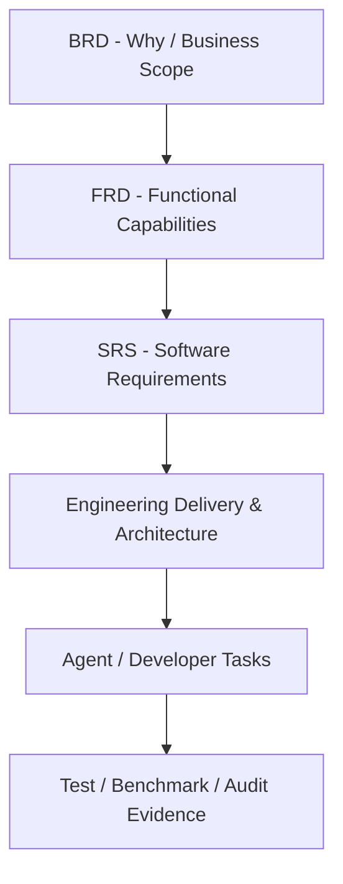

# BikeSport Requirements Documentation

**Trạng thái:** Draft  
**Nhánh:** `docs/T001-requirements-20260815-0955`  
**Nguồn đầu vào:** trao đổi yêu cầu ngày 2026-08-15.

## Mục tiêu

Bộ tài liệu này mô tả BikeSport như một nền tảng thương mại điện tử gồm nhiều hệ thống con, thay vì coi Frontend, Backend, CMS và Odoo là các dự án độc lập.

## Cấu trúc

- `01-business/BRD.md`: mục tiêu, phạm vi và yêu cầu nghiệp vụ cấp cao.
- `02-functional/FRD.md`: năng lực chức năng theo domain nghiệp vụ.
- `03-system/system-context.md`: ranh giới và quan hệ giữa các hệ thống.
- `03-system/data-ownership.md`: ma trận dữ liệu và source of truth cần xác nhận.
- `03-system/SRS-Storefront.md`: yêu cầu phần mềm Storefront.
- `03-system/SRS-Commerce-Backend.md`: yêu cầu Commerce Backend.
- `03-system/SRS-CMS.md`: yêu cầu CMS.
- `03-system/SRS-Odoo-Backoffice.md`: yêu cầu Odoo Back-office.
- `04-integration/INT-Odoo-Commerce.md`: tích hợp Commerce - Odoo.
- `05-process-flows/FLOW-001-order-to-fulfillment.md`: luồng đặt hàng xuyên hệ thống ban đầu.
- `06-engineering/README.md`: đầu mối tài liệu thực thi kỹ thuật cho developer/agent.
- `06-engineering/delivery-plan.md`: phase, work package, dependency và exit gate.
- `06-engineering/agent-work-contract.md`: contract giao task, allowed scope, forbidden scope và Definition of Done.
- `06-engineering/architecture-blueprint.md`: logical architecture và responsibility boundary.
- `06-engineering/data-architecture.md`: kiến trúc dữ liệu, logical model và quy tắc schema change.
- `06-engineering/quality-gates.md`: security, performance, reliability, accessibility và evidence để xác nhận đạt.
- `06-engineering/storefront-design-system.md`: design token architecture và contract UI cho Storefront.
- `07-traceability/requirements-matrix.md`: ma trận truy vết ban đầu.

## Quan hệ giữa các lớp tài liệu

`06-engineering` không tạo business requirement mới. Nó chuyển requirement đã có thành ranh giới kỹ thuật, dependency, task contract và quality gate có thể kiểm chứng.

## Quy tắc tài liệu

- Chỉ dữ kiện người dùng đã nêu rõ mới được ghi là `Đã xác nhận`.
- Các quyết định kiến trúc/nghiệp vụ chưa chốt được ghi `Giả định cần xác nhận`, `Proposed`, `TBD` hoặc `Câu hỏi mở`.
- BRD/FRD đi theo nghiệp vụ; SRS đi theo ranh giới phần mềm.
- Database không quyết định ranh giới nghiệp vụ. MongoDB và PostgreSQL có thể cùng tồn tại nếu ownership dữ liệu rõ ràng.
- Không ghi security/performance là `Verified/Pass` nếu chưa có evidence cụ thể.
- Agent chỉ được thực hiện phần nằm trong task contract; thay đổi ngoài scope phải được tách thành quyết định hoặc task mới.
