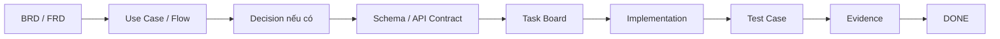

# BikeSport Requirements & Delivery Documentation

**Trạng thái:** Active Draft  
**Nhánh:** `docs/T001-requirements-20260815-0955`

Bộ tài liệu này được tổ chức để một BA, PO, PM, Developer/Architect, Tester hoặc agent có thể cùng làm việc trên một nguồn sự thật chung. Không tài liệu nào được đứng riêng: requirement phải trace xuống schema/API, task và test evidence.

## 1. Cấu trúc tài liệu

### `00-project/` - PO / PM control

- `project-charter.md`: mục tiêu dự án, governance, Definition of Ready/Done.
- `product-backlog.md`: capability backlog, priority, MVP gate và acceptance outcome.
- `decision-log.md`: nguồn duy nhất cho quyết định ownership/architecture/schema/integration đang mở hoặc đã phê duyệt.

### `01-business/` - BA business layer

- `BRD.md`: business objective, scope và business requirement.

### `02-functional/` - BA functional layer

- `FRD.md`: functional requirement theo domain.
- `use-cases-core.md`: use case Product, Inventory, Reservation, Order, Pricing, Warranty, Authorization; mỗi use case link task và test.

### `03-system/` - Software requirements

- `system-context.md`: Storefront, CMS, Commerce Backend, Odoo và system boundary.
- `data-ownership.md`: source of truth và quyền ghi dữ liệu.
- `SRS-Storefront.md`
- `SRS-Commerce-Backend.md`
- `SRS-CMS.md`
- `SRS-Odoo-Backoffice.md`

### `04-integration/`

- `INT-Odoo-Commerce.md`: integration boundary Odoo - Commerce. Contract chi tiết tiếp tục được khóa theo `DEC-*`/`INT-*` task.

### `05-process-flows/`

- `FLOW-001-order-to-fulfillment.md`: luồng Order-to-Fulfillment ban đầu.

### `06-engineering/` - Developer / Architect / Task control

- `project-task-board.md`: phase, task, dependency, trạng thái, blocker và evidence.
- `database-architecture.md`: **canonical database schema baseline** cho MongoDB + Odoo/PostgreSQL; định nghĩa collection/model/table/field/index/relation. Agent không được tự tạo schema khác.
- `storefront-design-system.md`: design token architecture, component inventory và task Design System.

### `06-testing/` - QA / Tester

- `test-strategy.md`: test layer, entry/exit criteria, severity và test data.
- `core-test-cases.md`: test case Product, Inventory, Reservation, Pricing, Order, Warranty, Authorization; link trực tiếp requirement/use case/task.

### `07-traceability/`

- `requirements-matrix.md`: chuỗi `BR -> FR -> UC/FLOW -> Schema/API -> Task -> Test -> Evidence`.

## 2. Luồng làm việc bắt buộc

Không được tự bỏ qua một layer đang là dependency của task.

## 3. Khi agent nhận task

Agent phải đọc theo thứ tự:

1. Task ID trong `project-task-board.md`.
2. Requirement/Use Case liên quan trong BRD/FRD/use-cases.
3. Decision liên quan trong `decision-log.md`.
4. Schema canonical trong `database-architecture.md` nếu chạm data.
5. Integration contract nếu chạm Odoo/Commerce boundary.
6. Design System nếu chạm Storefront UI.
7. Test case tương ứng trong `06-testing/core-test-cases.md`.

Sau khi làm xong phải cập nhật `Status` và `Evidence`. Không có evidence thì không được ghi `DONE`.

## 4. Schema governance

`06-engineering/database-architecture.md` là baseline canonical ngay cả khi một số ownership decision còn mở.

- Không tạo collection/table/model/field mới ngoài baseline.
- Không đổi type/relation/index tùy ý.
- Nếu thật sự cần thay schema: tạo `DATA-CHG-xxx`, cập nhật baseline trước, mô tả migration/backward compatibility và cập nhật task/test liên quan.

## 5. Trạng thái thực tế hiện tại

- Requirements: Draft/Review.
- Database schema baseline: đã có canonical draft; ownership của một số field/domain còn chờ `DEC-*`.
- Odoo/Backend/CMS/Storefront implementation: chưa triển khai trong repository này.
- Security verification: chưa có evidence.
- Performance verification: chưa có target/evidence đầy đủ.
- Role/permission matrix: chưa chốt.
- Order System of Record: chưa chốt.
- Pricing/Promotion authority: chưa chốt.

Các blocker được quản lý bằng `DEC-001` đến `DEC-010`; không agent nào được tự quyết để unblock task.
